# Projects and dependencies analysis

This document provides a comprehensive overview of the projects and their dependencies in the context of upgrading to .NETCoreApp,Version=v10.0.

## Table of Contents

- [Executive Summary](#executive-Summary)
  - [Highlevel Metrics](#highlevel-metrics)
  - [Projects Compatibility](#projects-compatibility)
  - [Package Compatibility](#package-compatibility)
  - [API Compatibility](#api-compatibility)
- [Aggregate NuGet packages details](#aggregate-nuget-packages-details)
- [Top API Migration Challenges](#top-api-migration-challenges)
  - [Technologies and Features](#technologies-and-features)
  - [Most Frequent API Issues](#most-frequent-api-issues)
- [Projects Relationship Graph](#projects-relationship-graph)
- [Project Details](#project-details)

  - [docker-compose.dcproj](#docker-composedcproj)
  - [src\Administration\Administration.csproj](#srcadministrationadministrationcsproj)
  - [src\Authentication\Authentication.csproj](#srcauthenticationauthenticationcsproj)
  - [src\Calendar\Calendar.csproj](#srccalendarcalendarcsproj)
  - [src\Codes\Codes.csproj](#srccodescodescsproj)
  - [src\Collectors\Collector\Collector.csproj](#srccollectorscollectorcollectorcsproj)
  - [src\Collectors\CollectorFactory\CollectorFactory.csproj](#srccollectorscollectorfactorycollectorfactorycsproj)
  - [src\Collectors\CollectorsController\CollectorsController.csproj](#srccollectorscollectorscontrollercollectorscontrollercsproj)
  - [src\Collectors\CollectorSupport\CollectorSupport.csproj](#srccollectorscollectorsupportcollectorsupportcsproj)
  - [src\Collectors\Fhir2Collector\Fhir2Collector.csproj](#srccollectorsfhir2collectorfhir2collectorcsproj)
  - [src\Collectors\Fhir3Collector\Fhir3Collector.csproj](#srccollectorsfhir3collectorfhir3collectorcsproj)
  - [src\Collectors\Fhir4bCollector\Fhir4bCollector.csproj](#srccollectorsfhir4bcollectorfhir4bcollectorcsproj)
  - [src\Collectors\Fhir4Collector\Fhir4Collector.csproj](#srccollectorsfhir4collectorfhir4collectorcsproj)
  - [src\Collectors\Fhir5Collector\Fhir5Collector.csproj](#srccollectorsfhir5collectorfhir5collectorcsproj)
  - [src\Collectors\Hl7c-CDACollector\Hl7CDACollector.csproj](#srccollectorshl7c-cdacollectorhl7cdacollectorcsproj)
  - [src\Collectors\Hl7v2Collector\Hl7v2Collector.csproj](#srccollectorshl7v2collectorhl7v2collectorcsproj)
  - [src\Collectors\Hl7v3Collector\Hl7v3Collector.csproj](#srccollectorshl7v3collectorhl7v3collectorcsproj)
  - [src\Collectors\X12Collector\X12Collector.csproj](#srccollectorsx12collectorx12collectorcsproj)
  - [src\PalisaidMeta\PalisaidMeta.csproj](#srcpalisaidmetapalisaidmetacsproj)
  - [src\PopulationHealth\PopulationHealth.csproj](#srcpopulationhealthpopulationhealthcsproj)
  - [src\PrimaryControllers\Primary.csproj](#srcprimarycontrollersprimarycsproj)
  - [src\Reports\Reports.csproj](#srcreportsreportscsproj)
  - [src\Retrievers\Eligibility\Eligibility.csproj](#srcretrieverseligibilityeligibilitycsproj)
  - [src\Retrievers\ICD\ICD.csproj](#srcretrieversicdicdcsproj)
  - [src\Retrievers\LOINC\LOINC.csproj](#srcretrieversloincloinccsproj)
  - [src\Retrievers\NDC\NDC.csproj](#srcretrieversndcndccsproj)
  - [src\Retrievers\Retriever\Retriever.csproj](#srcretrieversretrieverretrievercsproj)
  - [src\Retrievers\RetrieverController\RetrieverController.csproj](#srcretrieversretrievercontrollerretrievercontrollercsproj)
  - [src\Retrievers\RetrieverFactory\RetrieverFactory.csproj](#srcretrieversretrieverfactoryretrieverfactorycsproj)
  - [src\Retrievers\SNOMED\SNOMED.csproj](#srcretrieverssnomedsnomedcsproj)
  - [src\Support\Support.csproj](#srcsupportsupportcsproj)
  - [src\Transformers\HL7FhirTransformer\HL7FhirTransformer.csproj](#srctransformershl7fhirtransformerhl7fhirtransformercsproj)
  - [src\Transformers\HL7v2Transformer\HL7v2Transformer.csproj](#srctransformershl7v2transformerhl7v2transformercsproj)
  - [src\Transformers\Transformer\Transformer.csproj](#srctransformerstransformertransformercsproj)
  - [src\Transformers\TransformerControler\TransformerControler.csproj](#srctransformerstransformercontrolertransformercontrolercsproj)
  - [src\Transformers\TransformerFactory\TransformerFactory.csproj](#srctransformerstransformerfactorytransformerfactorycsproj)
  - [src\Transformers\X12Transformer\X12Transformer.csproj](#srctransformersx12transformerx12transformercsproj)
  - [src\Transporters\Fhir2Transporter\Fhir2Transporter.csproj](#srctransportersfhir2transporterfhir2transportercsproj)
  - [src\Transporters\Fhir3Transporter\Fhir3Transporter.csproj](#srctransportersfhir3transporterfhir3transportercsproj)
  - [src\Transporters\Fhir4bTransporter\Fhir4bTransporter.csproj](#srctransportersfhir4btransporterfhir4btransportercsproj)
  - [src\Transporters\Fhir4Transporter\Fhir4Transporter.csproj](#srctransportersfhir4transporterfhir4transportercsproj)
  - [src\Transporters\Fhir5Transporter\Fhir5Transporter.csproj](#srctransportersfhir5transporterfhir5transportercsproj)
  - [src\Transporters\MLLPTransporter\MLLPTransporter.csproj](#srctransportersmllptransportermllptransportercsproj)
  - [src\Transporters\RESTTransporter\RESTTransporter.csproj](#srctransportersresttransporterresttransportercsproj)
  - [src\Transporters\TCPIPTransporter\TCPIPTransporter.csproj](#srctransporterstcpiptransportertcpiptransportercsproj)
  - [src\Transporters\Transporter\Transporter.csproj](#srctransporterstransportertransportercsproj)
  - [src\Transporters\TransporterController\TransporterController.csproj](#srctransporterstransportercontrollertransportercontrollercsproj)
  - [src\Transporters\TransporterFactory\TransporterFactory.csproj](#srctransporterstransporterfactorytransporterfactorycsproj)
  - [src\Vectors\Lists.csproj](#srcvectorslistscsproj)
  - [test\CollectorTests\CollectorTests\CollectorTests.csproj](#testcollectortestscollectortestscollectortestscsproj)
  - [test\DevTests\DevTests.csproj](#testdevtestsdevtestscsproj)
  - [test\IntegrationTests\IntegrationTests.csproj](#testintegrationtestsintegrationtestscsproj)
  - [test\UnitTests\UnitTests.csproj](#testunittestsunittestscsproj)


## Executive Summary

### Highlevel Metrics

| Metric | Count | Status |
| :--- | :---: | :--- |
| Total Projects | 53 | 52 require upgrade |
| Total NuGet Packages | 45 | 19 need upgrade |
| Total Code Files | 266 |  |
| Total Code Files with Incidents | 72 |  |
| Total Lines of Code | 33504 |  |
| Total Number of Issues | 226 |  |
| Estimated LOC to modify | 113+ | at least 0.3% of codebase |

### Projects Compatibility

| Project | Target Framework | Difficulty | Package Issues | API Issues | Est. LOC Impact | Description |
| :--- | :---: | :---: | :---: | :---: | :---: | :--- |
| [docker-compose.dcproj](#docker-composedcproj) |  | ✅ None | 0 | 0 |  | DotNetCoreApp, Sdk Style = True |
| [src\Administration\Administration.csproj](#srcadministrationadministrationcsproj) | net8.0 | 🟢 Low | 4 | 0 |  | AspNetCore, Sdk Style = True |
| [src\Authentication\Authentication.csproj](#srcauthenticationauthenticationcsproj) | net8.0 | 🟢 Low | 4 | 35 | 35+ | AspNetCore, Sdk Style = True |
| [src\Calendar\Calendar.csproj](#srccalendarcalendarcsproj) | net8.0 | 🟢 Low | 1 | 0 |  | AspNetCore, Sdk Style = True |
| [src\Codes\Codes.csproj](#srccodescodescsproj) | net8.0 | 🟢 Low | 3 | 0 |  | AspNetCore, Sdk Style = True |
| [src\Collectors\Collector\Collector.csproj](#srccollectorscollectorcollectorcsproj) | net8.0 | 🟢 Low | 3 | 0 |  | AspNetCore, Sdk Style = True |
| [src\Collectors\CollectorFactory\CollectorFactory.csproj](#srccollectorscollectorfactorycollectorfactorycsproj) | net8.0 | 🟢 Low | 1 | 0 |  | ClassLibrary, Sdk Style = True |
| [src\Collectors\CollectorsController\CollectorsController.csproj](#srccollectorscollectorscontrollercollectorscontrollercsproj) | net8.0 | 🟢 Low | 1 | 0 |  | AspNetCore, Sdk Style = True |
| [src\Collectors\CollectorSupport\CollectorSupport.csproj](#srccollectorscollectorsupportcollectorsupportcsproj) | net8.0 | 🟢 Low | 6 | 5 | 5+ | AspNetCore, Sdk Style = True |
| [src\Collectors\Fhir2Collector\Fhir2Collector.csproj](#srccollectorsfhir2collectorfhir2collectorcsproj) | net8.0 | 🟢 Low | 1 | 0 |  | AspNetCore, Sdk Style = True |
| [src\Collectors\Fhir3Collector\Fhir3Collector.csproj](#srccollectorsfhir3collectorfhir3collectorcsproj) | net8.0 | 🟢 Low | 1 | 0 |  | AspNetCore, Sdk Style = True |
| [src\Collectors\Fhir4bCollector\Fhir4bCollector.csproj](#srccollectorsfhir4bcollectorfhir4bcollectorcsproj) | net8.0 | 🟢 Low | 1 | 0 |  | AspNetCore, Sdk Style = True |
| [src\Collectors\Fhir4Collector\Fhir4Collector.csproj](#srccollectorsfhir4collectorfhir4collectorcsproj) | net8.0 | 🟢 Low | 2 | 0 |  | AspNetCore, Sdk Style = True |
| [src\Collectors\Fhir5Collector\Fhir5Collector.csproj](#srccollectorsfhir5collectorfhir5collectorcsproj) | net8.0 | 🟢 Low | 2 | 0 |  | AspNetCore, Sdk Style = True |
| [src\Collectors\Hl7c-CDACollector\Hl7CDACollector.csproj](#srccollectorshl7c-cdacollectorhl7cdacollectorcsproj) | net8.0 | 🟢 Low | 2 | 0 |  | AspNetCore, Sdk Style = True |
| [src\Collectors\Hl7v2Collector\Hl7v2Collector.csproj](#srccollectorshl7v2collectorhl7v2collectorcsproj) | net8.0 | 🟢 Low | 2 | 0 |  | AspNetCore, Sdk Style = True |
| [src\Collectors\Hl7v3Collector\Hl7v3Collector.csproj](#srccollectorshl7v3collectorhl7v3collectorcsproj) | net8.0 | 🟢 Low | 1 | 0 |  | AspNetCore, Sdk Style = True |
| [src\Collectors\X12Collector\X12Collector.csproj](#srccollectorsx12collectorx12collectorcsproj) | net8.0 | 🟢 Low | 1 | 0 |  | AspNetCore, Sdk Style = True |
| [src\PalisaidMeta\PalisaidMeta.csproj](#srcpalisaidmetapalisaidmetacsproj) | net8.0 | 🟢 Low | 5 | 20 | 20+ | ClassLibrary, Sdk Style = True |
| [src\PopulationHealth\PopulationHealth.csproj](#srcpopulationhealthpopulationhealthcsproj) | net8.0 | 🟢 Low | 1 | 0 |  | AspNetCore, Sdk Style = True |
| [src\PrimaryControllers\Primary.csproj](#srcprimarycontrollersprimarycsproj) | net8.0 | 🟢 Low | 5 | 31 | 31+ | AspNetCore, Sdk Style = True |
| [src\Reports\Reports.csproj](#srcreportsreportscsproj) | net8.0 | 🟢 Low | 1 | 0 |  | AspNetCore, Sdk Style = True |
| [src\Retrievers\Eligibility\Eligibility.csproj](#srcretrieverseligibilityeligibilitycsproj) | net8.0 | 🟢 Low | 0 | 0 |  | ClassLibrary, Sdk Style = True |
| [src\Retrievers\ICD\ICD.csproj](#srcretrieversicdicdcsproj) | net8.0 | 🟢 Low | 0 | 0 |  | ClassLibrary, Sdk Style = True |
| [src\Retrievers\LOINC\LOINC.csproj](#srcretrieversloincloinccsproj) | net8.0 | 🟢 Low | 0 | 0 |  | ClassLibrary, Sdk Style = True |
| [src\Retrievers\NDC\NDC.csproj](#srcretrieversndcndccsproj) | net8.0 | 🟢 Low | 0 | 0 |  | ClassLibrary, Sdk Style = True |
| [src\Retrievers\Retriever\Retriever.csproj](#srcretrieversretrieverretrievercsproj) | net6.0 | 🟢 Low | 0 | 0 |  | ClassLibrary, Sdk Style = True |
| [src\Retrievers\RetrieverController\RetrieverController.csproj](#srcretrieversretrievercontrollerretrievercontrollercsproj) | net6.0 | 🟢 Low | 0 | 0 |  | AspNetCore, Sdk Style = True |
| [src\Retrievers\RetrieverFactory\RetrieverFactory.csproj](#srcretrieversretrieverfactoryretrieverfactorycsproj) | net6.0 | 🟢 Low | 0 | 0 |  | ClassLibrary, Sdk Style = True |
| [src\Retrievers\SNOMED\SNOMED.csproj](#srcretrieverssnomedsnomedcsproj) | net8.0 | 🟢 Low | 0 | 0 |  | ClassLibrary, Sdk Style = True |
| [src\Support\Support.csproj](#srcsupportsupportcsproj) | net8.0 | 🟢 Low | 3 | 6 | 6+ | ClassLibrary, Sdk Style = True |
| [src\Transformers\HL7FhirTransformer\HL7FhirTransformer.csproj](#srctransformershl7fhirtransformerhl7fhirtransformercsproj) | net8.0 | 🟢 Low | 0 | 0 |  | ClassLibrary, Sdk Style = True |
| [src\Transformers\HL7v2Transformer\HL7v2Transformer.csproj](#srctransformershl7v2transformerhl7v2transformercsproj) | net8.0 | 🟢 Low | 0 | 0 |  | ClassLibrary, Sdk Style = True |
| [src\Transformers\Transformer\Transformer.csproj](#srctransformerstransformertransformercsproj) | net8.0 | 🟢 Low | 1 | 0 |  | ClassLibrary, Sdk Style = True |
| [src\Transformers\TransformerControler\TransformerControler.csproj](#srctransformerstransformercontrolertransformercontrolercsproj) | net6.0 | 🟢 Low | 0 | 0 |  | AspNetCore, Sdk Style = True |
| [src\Transformers\TransformerFactory\TransformerFactory.csproj](#srctransformerstransformerfactorytransformerfactorycsproj) | net8.0 | 🟢 Low | 0 | 3 | 3+ | ClassLibrary, Sdk Style = True |
| [src\Transformers\X12Transformer\X12Transformer.csproj](#srctransformersx12transformerx12transformercsproj) | net8.0 | 🟢 Low | 0 | 0 |  | ClassLibrary, Sdk Style = True |
| [src\Transporters\Fhir2Transporter\Fhir2Transporter.csproj](#srctransportersfhir2transporterfhir2transportercsproj) | net8.0 | 🟢 Low | 0 | 3 | 3+ | ClassLibrary, Sdk Style = True |
| [src\Transporters\Fhir3Transporter\Fhir3Transporter.csproj](#srctransportersfhir3transporterfhir3transportercsproj) | net8.0 | 🟢 Low | 0 | 0 |  | ClassLibrary, Sdk Style = True |
| [src\Transporters\Fhir4bTransporter\Fhir4bTransporter.csproj](#srctransportersfhir4btransporterfhir4btransportercsproj) | net8.0 | 🟢 Low | 0 | 0 |  | ClassLibrary, Sdk Style = True |
| [src\Transporters\Fhir4Transporter\Fhir4Transporter.csproj](#srctransportersfhir4transporterfhir4transportercsproj) | net8.0 | 🟢 Low | 0 | 1 | 1+ | ClassLibrary, Sdk Style = True |
| [src\Transporters\Fhir5Transporter\Fhir5Transporter.csproj](#srctransportersfhir5transporterfhir5transportercsproj) | net8.0 | 🟢 Low | 0 | 0 |  | ClassLibrary, Sdk Style = True |
| [src\Transporters\MLLPTransporter\MLLPTransporter.csproj](#srctransportersmllptransportermllptransportercsproj) | net8.0 | 🟢 Low | 0 | 0 |  | ClassLibrary, Sdk Style = True |
| [src\Transporters\RESTTransporter\RESTTransporter.csproj](#srctransportersresttransporterresttransportercsproj) | net8.0 | 🟢 Low | 0 | 0 |  | ClassLibrary, Sdk Style = True |
| [src\Transporters\TCPIPTransporter\TCPIPTransporter.csproj](#srctransporterstcpiptransportertcpiptransportercsproj) | net8.0 | 🟢 Low | 0 | 0 |  | ClassLibrary, Sdk Style = True |
| [src\Transporters\Transporter\Transporter.csproj](#srctransporterstransportertransportercsproj) | net8.0 | 🟢 Low | 0 | 0 |  | ClassLibrary, Sdk Style = True |
| [src\Transporters\TransporterController\TransporterController.csproj](#srctransporterstransportercontrollertransportercontrollercsproj) | net6.0 | 🟢 Low | 0 | 0 |  | AspNetCore, Sdk Style = True |
| [src\Transporters\TransporterFactory\TransporterFactory.csproj](#srctransporterstransporterfactorytransporterfactorycsproj) | net8.0 | 🟢 Low | 0 | 0 |  | ClassLibrary, Sdk Style = True |
| [src\Vectors\Lists.csproj](#srcvectorslistscsproj) | net8.0 | 🟢 Low | 4 | 0 |  | AspNetCore, Sdk Style = True |
| [test\CollectorTests\CollectorTests\CollectorTests.csproj](#testcollectortestscollectortestscollectortestscsproj) | net8.0 | 🟢 Low | 0 | 0 |  | DotNetCoreApp, Sdk Style = True |
| [test\DevTests\DevTests.csproj](#testdevtestsdevtestscsproj) | net8.0 | 🟢 Low | 0 | 3 | 3+ | DotNetCoreApp, Sdk Style = True |
| [test\IntegrationTests\IntegrationTests.csproj](#testintegrationtestsintegrationtestscsproj) | net8.0 | 🟢 Low | 4 | 6 | 6+ | DotNetCoreApp, Sdk Style = True |
| [test\UnitTests\UnitTests.csproj](#testunittestsunittestscsproj) | net8.0 | 🟢 Low | 1 | 0 |  | DotNetCoreApp, Sdk Style = True |

### Package Compatibility

| Status | Count | Percentage |
| :--- | :---: | :---: |
| ✅ Compatible | 26 | 57.8% |
| ⚠️ Incompatible | 5 | 11.1% |
| 🔄 Upgrade Recommended | 14 | 31.1% |
| ***Total NuGet Packages*** | ***45*** | ***100%*** |

### API Compatibility

| Category | Count | Impact |
| :--- | :---: | :--- |
| 🔴 Binary Incompatible | 43 | High - Require code changes |
| 🟡 Source Incompatible | 26 | Medium - Needs re-compilation and potential conflicting API error fixing |
| 🔵 Behavioral change | 44 | Low - Behavioral changes that may require testing at runtime |
| ✅ Compatible | 36755 |  |
| ***Total APIs Analyzed*** | ***36868*** |  |

## Aggregate NuGet packages details

| Package | Current Version | Suggested Version | Projects | Description |
| :--- | :---: | :---: | :--- | :--- |
| Bogus | 35.0.1 |  | [DevTests.csproj](#testdevtestsdevtestscsproj)<br/>[IntegrationTests.csproj](#testintegrationtestsintegrationtestscsproj) | ✅Compatible |
| Confluent.Kafka | 2.3.0 |  | [Collector.csproj](#srccollectorscollectorcollectorcsproj)<br/>[Transporter.csproj](#srctransporterstransportertransportercsproj) | ✅Compatible |
| coverlet.collector | 6.0.0 |  | [CollectorTests.csproj](#testcollectortestscollectortestscollectortestscsproj)<br/>[DevTests.csproj](#testdevtestsdevtestscsproj)<br/>[IntegrationTests.csproj](#testintegrationtestsintegrationtestscsproj) | ✅Compatible |
| coverlet.collector | 6.0.4 |  | [UnitTests.csproj](#testunittestsunittestscsproj) | ✅Compatible |
| EasyNetQ | 7.8.0 |  | [Support.csproj](#srcsupportsupportcsproj)<br/>[Transformer.csproj](#srctransformerstransformertransformercsproj) | ✅Compatible |
| Hl7.Fhir.DSTU2 | 1.9.1.1 |  | [Fhir2Collector.csproj](#srccollectorsfhir2collectorfhir2collectorcsproj)<br/>[Fhir2Transporter.csproj](#srctransportersfhir2transporterfhir2transportercsproj) | ✅Compatible |
| Hl7.Fhir.R4 | 5.4.0 |  | [CollectorSupport.csproj](#srccollectorscollectorsupportcollectorsupportcsproj)<br/>[DevTests.csproj](#testdevtestsdevtestscsproj)<br/>[Fhir4Collector.csproj](#srccollectorsfhir4collectorfhir4collectorcsproj)<br/>[Fhir4Transporter.csproj](#srctransportersfhir4transporterfhir4transportercsproj)<br/>[Transformer.csproj](#srctransformerstransformertransformercsproj)<br/>[TransformerFactory.csproj](#srctransformerstransformerfactorytransformerfactorycsproj) | ✅Compatible |
| Hl7.Fhir.R4B | 5.4.0 |  | [Fhir4bCollector.csproj](#srccollectorsfhir4bcollectorfhir4bcollectorcsproj)<br/>[Fhir4bTransporter.csproj](#srctransportersfhir4btransporterfhir4btransportercsproj) | ✅Compatible |
| Hl7.Fhir.R5 | 5.4.0 |  | [Fhir5Collector.csproj](#srccollectorsfhir5collectorfhir5collectorcsproj)<br/>[Fhir5Transporter.csproj](#srctransportersfhir5transporterfhir5transportercsproj) | ✅Compatible |
| Hl7.Fhir.STU3 | 5.4.0 |  | [Fhir3Collector.csproj](#srccollectorsfhir3collectorfhir3collectorcsproj)<br/>[Fhir3Transporter.csproj](#srctransportersfhir3transporterfhir3transportercsproj) | ✅Compatible |
| LinqKit | 1.2.5 |  | [Primary.csproj](#srcprimarycontrollersprimarycsproj) | ✅Compatible |
| Microsoft.AspNetCore | 2.2.0 |  | [IntegrationTests.csproj](#testintegrationtestsintegrationtestscsproj) | ⚠️NuGet package is deprecated |
| Microsoft.AspNetCore.Authentication.JwtBearer | 8.0.0 | 10.0.4 | [Support.csproj](#srcsupportsupportcsproj) | NuGet package upgrade is recommended |
| Microsoft.AspNetCore.Http.Connections.Client | 8.0.1 | 10.0.4 | [IntegrationTests.csproj](#testintegrationtestsintegrationtestscsproj) | NuGet package upgrade is recommended |
| Microsoft.AspNetCore.Identity | 2.2.0 |  | [Support.csproj](#srcsupportsupportcsproj) | ⚠️NuGet package is deprecated |
| Microsoft.AspNetCore.Identity.EntityFrameworkCore | 8.0.0 | 10.0.4 | [Support.csproj](#srcsupportsupportcsproj) | NuGet package upgrade is recommended |
| Microsoft.AspNetCore.OpenApi | 8.0.0 | 10.0.4 | [Administration.csproj](#srcadministrationadministrationcsproj)<br/>[Authentication.csproj](#srcauthenticationauthenticationcsproj)<br/>[Calendar.csproj](#srccalendarcalendarcsproj)<br/>[Codes.csproj](#srccodescodescsproj)<br/>[Collector.csproj](#srccollectorscollectorcollectorcsproj)<br/>[CollectorsController.csproj](#srccollectorscollectorscontrollercollectorscontrollercsproj)<br/>[CollectorSupport.csproj](#srccollectorscollectorsupportcollectorsupportcsproj)<br/>[Fhir2Collector.csproj](#srccollectorsfhir2collectorfhir2collectorcsproj)<br/>[Fhir3Collector.csproj](#srccollectorsfhir3collectorfhir3collectorcsproj)<br/>[Fhir4bCollector.csproj](#srccollectorsfhir4bcollectorfhir4bcollectorcsproj)<br/>[Fhir4Collector.csproj](#srccollectorsfhir4collectorfhir4collectorcsproj)<br/>[Fhir5Collector.csproj](#srccollectorsfhir5collectorfhir5collectorcsproj)<br/>[Hl7CDACollector.csproj](#srccollectorshl7c-cdacollectorhl7cdacollectorcsproj)<br/>[Hl7v2Collector.csproj](#srccollectorshl7v2collectorhl7v2collectorcsproj)<br/>[Hl7v3Collector.csproj](#srccollectorshl7v3collectorhl7v3collectorcsproj)<br/>[Lists.csproj](#srcvectorslistscsproj)<br/>[PopulationHealth.csproj](#srcpopulationhealthpopulationhealthcsproj)<br/>[Primary.csproj](#srcprimarycontrollersprimarycsproj)<br/>[Reports.csproj](#srcreportsreportscsproj)<br/>[X12Collector.csproj](#srccollectorsx12collectorx12collectorcsproj) | NuGet package upgrade is recommended |
| Microsoft.EntityFrameworkCore | 8.0.0 | 10.0.4 | [Administration.csproj](#srcadministrationadministrationcsproj)<br/>[Authentication.csproj](#srcauthenticationauthenticationcsproj)<br/>[Collector.csproj](#srccollectorscollectorcollectorcsproj)<br/>[CollectorSupport.csproj](#srccollectorscollectorsupportcollectorsupportcsproj)<br/>[Lists.csproj](#srcvectorslistscsproj)<br/>[PalisaidMeta.csproj](#srcpalisaidmetapalisaidmetacsproj)<br/>[Primary.csproj](#srcprimarycontrollersprimarycsproj)<br/>[Transformer.csproj](#srctransformerstransformertransformercsproj) | NuGet package upgrade is recommended |
| Microsoft.EntityFrameworkCore | 8.0.1 | 10.0.4 | [IntegrationTests.csproj](#testintegrationtestsintegrationtestscsproj) | NuGet package upgrade is recommended |
| Microsoft.EntityFrameworkCore.Design | 8.0.0 | 10.0.4 | [Administration.csproj](#srcadministrationadministrationcsproj)<br/>[Authentication.csproj](#srcauthenticationauthenticationcsproj)<br/>[Collector.csproj](#srccollectorscollectorcollectorcsproj)<br/>[CollectorSupport.csproj](#srccollectorscollectorsupportcollectorsupportcsproj)<br/>[Lists.csproj](#srcvectorslistscsproj)<br/>[PalisaidMeta.csproj](#srcpalisaidmetapalisaidmetacsproj)<br/>[Primary.csproj](#srcprimarycontrollersprimarycsproj) | NuGet package upgrade is recommended |
| Microsoft.EntityFrameworkCore.Tools | 8.0.0 | 10.0.4 | [Primary.csproj](#srcprimarycontrollersprimarycsproj) | NuGet package upgrade is recommended |
| Microsoft.EntityFrameworkCore.Tools | 8.0.1 | 10.0.4 | [Codes.csproj](#srccodescodescsproj) | NuGet package upgrade is recommended |
| Microsoft.Extensions.Configuration | 8.0.0 | 10.0.4 | [PalisaidMeta.csproj](#srcpalisaidmetapalisaidmetacsproj) | NuGet package upgrade is recommended |
| Microsoft.Extensions.Configuration.Json | 8.0.0 | 10.0.4 | [PalisaidMeta.csproj](#srcpalisaidmetapalisaidmetacsproj) | NuGet package upgrade is recommended |
| Microsoft.Extensions.Localization | 8.0.0 | 10.0.4 | [CollectorSupport.csproj](#srccollectorscollectorsupportcollectorsupportcsproj) | NuGet package upgrade is recommended |
| Microsoft.Extensions.Logging | 8.0.0 | 10.0.4 | [CollectorFactory.csproj](#srccollectorscollectorfactorycollectorfactorycsproj) | NuGet package upgrade is recommended |
| Microsoft.NET.Test.Sdk | 17.8.0 |  | [CollectorTests.csproj](#testcollectortestscollectortestscollectortestscsproj)<br/>[DevTests.csproj](#testdevtestsdevtestscsproj)<br/>[IntegrationTests.csproj](#testintegrationtestsintegrationtestscsproj) | ✅Compatible |
| Microsoft.NET.Test.Sdk | 18.0.1 |  | [UnitTests.csproj](#testunittestsunittestscsproj) | ✅Compatible |
| Microsoft.VisualStudio.Azure.Containers.Tools.Targets | 1.19.5 |  | [Fhir4Collector.csproj](#srccollectorsfhir4collectorfhir4collectorcsproj)<br/>[Fhir5Collector.csproj](#srccollectorsfhir5collectorfhir5collectorcsproj)<br/>[Hl7CDACollector.csproj](#srccollectorshl7c-cdacollectorhl7cdacollectorcsproj)<br/>[Hl7v2Collector.csproj](#srccollectorshl7v2collectorhl7v2collectorcsproj) | ⚠️NuGet package is incompatible |
| nhapi | 3.2.2 |  | [Hl7CDACollector.csproj](#srccollectorshl7c-cdacollectorhl7cdacollectorcsproj)<br/>[Hl7v2Collector.csproj](#srccollectorshl7v2collectorhl7v2collectorcsproj)<br/>[Hl7v3Collector.csproj](#srccollectorshl7v3collectorhl7v3collectorcsproj) | ✅Compatible |
| nHapi.Core | 2.6.0.2 |  | [HL7v2Transformer.csproj](#srctransformershl7v2transformerhl7v2transformercsproj) | ✅Compatible |
| NHapiTools | 2.0.4 |  | [Hl7CDACollector.csproj](#srccollectorshl7c-cdacollectorhl7cdacollectorcsproj)<br/>[Hl7v2Collector.csproj](#srccollectorshl7v2collectorhl7v2collectorcsproj)<br/>[HL7v2Transformer.csproj](#srctransformershl7v2transformerhl7v2transformercsproj)<br/>[Hl7v3Collector.csproj](#srccollectorshl7v3collectorhl7v3collectorcsproj) | ✅Compatible |
| NLog | 5.2.7 |  | [Support.csproj](#srcsupportsupportcsproj)<br/>[Transformer.csproj](#srctransformerstransformertransformercsproj) | ✅Compatible |
| Npgsql.EntityFrameworkCore.PostgreSQL | 8.0.0 |  | [Administration.csproj](#srcadministrationadministrationcsproj)<br/>[Authentication.csproj](#srcauthenticationauthenticationcsproj)<br/>[CollectorSupport.csproj](#srccollectorscollectorsupportcollectorsupportcsproj)<br/>[IntegrationTests.csproj](#testintegrationtestsintegrationtestscsproj)<br/>[Lists.csproj](#srcvectorslistscsproj)<br/>[PalisaidMeta.csproj](#srcpalisaidmetapalisaidmetacsproj)<br/>[Primary.csproj](#srcprimarycontrollersprimarycsproj) | ✅Compatible |
| Npgsql.EntityFrameworkCore.PostgreSQL.Design | 1.1.0 |  | [Administration.csproj](#srcadministrationadministrationcsproj)<br/>[Authentication.csproj](#srcauthenticationauthenticationcsproj)<br/>[Codes.csproj](#srccodescodescsproj)<br/>[CollectorSupport.csproj](#srccollectorscollectorsupportcollectorsupportcsproj)<br/>[IntegrationTests.csproj](#testintegrationtestsintegrationtestscsproj)<br/>[Lists.csproj](#srcvectorslistscsproj)<br/>[PalisaidMeta.csproj](#srcpalisaidmetapalisaidmetacsproj)<br/>[Primary.csproj](#srcprimarycontrollersprimarycsproj) | ⚠️NuGet package is deprecated |
| Quartz | 3.8.0 |  | [Collector.csproj](#srccollectorscollectorcollectorcsproj) | ✅Compatible |
| RabbitMQ.Client | 6.8.1 |  | [CollectorsController.csproj](#srccollectorscollectorscontrollercollectorscontrollercsproj) | ✅Compatible |
| RestSharp | 110.2.0 | 114.0.0 | [CollectorSupport.csproj](#srccollectorscollectorsupportcollectorsupportcsproj) | NuGet package contains security vulnerability |
| RestSharp.Serializers.SystemTextJson | 106.15.0 |  | [CollectorSupport.csproj](#srccollectorscollectorsupportcollectorsupportcsproj) | ✅Compatible |
| Swashbuckle.AspNetCore | 6.2.3 |  | [RetrieverController.csproj](#srcretrieversretrievercontrollerretrievercontrollercsproj)<br/>[TransporterController.csproj](#srctransporterstransportercontrollertransportercontrollercsproj) | ✅Compatible |
| Swashbuckle.AspNetCore | 6.5.0 |  | [Administration.csproj](#srcadministrationadministrationcsproj)<br/>[Authentication.csproj](#srcauthenticationauthenticationcsproj)<br/>[Calendar.csproj](#srccalendarcalendarcsproj)<br/>[Codes.csproj](#srccodescodescsproj)<br/>[Collector.csproj](#srccollectorscollectorcollectorcsproj)<br/>[CollectorsController.csproj](#srccollectorscollectorscontrollercollectorscontrollercsproj)<br/>[CollectorSupport.csproj](#srccollectorscollectorsupportcollectorsupportcsproj)<br/>[Fhir2Collector.csproj](#srccollectorsfhir2collectorfhir2collectorcsproj)<br/>[Fhir3Collector.csproj](#srccollectorsfhir3collectorfhir3collectorcsproj)<br/>[Fhir4bCollector.csproj](#srccollectorsfhir4bcollectorfhir4bcollectorcsproj)<br/>[Fhir4Collector.csproj](#srccollectorsfhir4collectorfhir4collectorcsproj)<br/>[Fhir5Collector.csproj](#srccollectorsfhir5collectorfhir5collectorcsproj)<br/>[Hl7CDACollector.csproj](#srccollectorshl7c-cdacollectorhl7cdacollectorcsproj)<br/>[Hl7v2Collector.csproj](#srccollectorshl7v2collectorhl7v2collectorcsproj)<br/>[Hl7v3Collector.csproj](#srccollectorshl7v3collectorhl7v3collectorcsproj)<br/>[Lists.csproj](#srcvectorslistscsproj)<br/>[PopulationHealth.csproj](#srcpopulationhealthpopulationhealthcsproj)<br/>[Primary.csproj](#srcprimarycontrollersprimarycsproj)<br/>[Reports.csproj](#srcreportsreportscsproj)<br/>[TransformerControler.csproj](#srctransformerstransformercontrolertransformercontrolercsproj)<br/>[X12Collector.csproj](#srccollectorsx12collectorx12collectorcsproj) | ✅Compatible |
| xunit | 2.6.3 |  | [CollectorTests.csproj](#testcollectortestscollectortestscollectortestscsproj)<br/>[DevTests.csproj](#testdevtestsdevtestscsproj)<br/>[IntegrationTests.csproj](#testintegrationtestsintegrationtestscsproj) | ✅Compatible |
| xunit | 2.9.3 |  | [UnitTests.csproj](#testunittestsunittestscsproj) | ⚠️NuGet package is deprecated |
| xunit.runner.visualstudio | 2.5.5 |  | [CollectorTests.csproj](#testcollectortestscollectortestscollectortestscsproj)<br/>[DevTests.csproj](#testdevtestsdevtestscsproj)<br/>[IntegrationTests.csproj](#testintegrationtestsintegrationtestscsproj) | ✅Compatible |
| xunit.runner.visualstudio | 3.1.5 |  | [UnitTests.csproj](#testunittestsunittestscsproj) | ✅Compatible |

## Top API Migration Challenges

### Technologies and Features

| Technology | Issues | Percentage | Migration Path |
| :--- | :---: | :---: | :--- |
| IdentityModel & Claims-based Security | 43 | 38.1% | Windows Identity Foundation (WIF), SAML, and claims-based authentication APIs that have been replaced by modern identity libraries. WIF was the original identity framework for .NET Framework. Migrate to Microsoft.IdentityModel.* packages (modern identity stack). |

### Most Frequent API Issues

| API | Count | Percentage | Category |
| :--- | :---: | :---: | :--- |
| T:System.Uri | 32 | 28.3% | Behavioral Change |
| T:System.IdentityModel.Tokens.Jwt.JwtSecurityTokenHandler | 7 | 6.2% | Binary Incompatible |
| M:System.IdentityModel.Tokens.Jwt.JwtSecurityTokenHandler.#ctor | 7 | 6.2% | Binary Incompatible |
| T:System.Net.Http.HttpContent | 7 | 6.2% | Behavioral Change |
| T:Microsoft.AspNetCore.Authentication.JwtBearer.JwtBearerDefaults | 6 | 5.3% | Source Incompatible |
| F:Microsoft.AspNetCore.Authentication.JwtBearer.JwtBearerDefaults.AuthenticationScheme | 6 | 5.3% | Source Incompatible |
| T:System.IdentityModel.Tokens.Jwt.JwtSecurityToken | 5 | 4.4% | Binary Incompatible |
| M:System.IdentityModel.Tokens.Jwt.JwtSecurityTokenHandler.WriteToken(Microsoft.IdentityModel.Tokens.SecurityToken) | 4 | 3.5% | Binary Incompatible |
| T:System.IdentityModel.Tokens.Jwt.JwtHeader | 2 | 1.8% | Binary Incompatible |
| P:System.IdentityModel.Tokens.Jwt.JwtSecurityToken.Header | 2 | 1.8% | Binary Incompatible |
| P:System.IdentityModel.Tokens.Jwt.JwtHeader.Alg | 2 | 1.8% | Binary Incompatible |
| M:System.IdentityModel.Tokens.Jwt.JwtSecurityTokenHandler.ValidateToken(System.String,Microsoft.IdentityModel.Tokens.TokenValidationParameters,Microsoft.IdentityModel.Tokens.SecurityToken@) | 2 | 1.8% | Binary Incompatible |
| P:System.IdentityModel.Tokens.Jwt.JwtSecurityToken.ValidTo | 2 | 1.8% | Binary Incompatible |
| T:System.IdentityModel.Tokens.Jwt.JwtRegisteredClaimNames | 2 | 1.8% | Binary Incompatible |
| F:System.IdentityModel.Tokens.Jwt.JwtRegisteredClaimNames.Jti | 2 | 1.8% | Binary Incompatible |
| P:Microsoft.AspNetCore.Authentication.JwtBearer.JwtBearerOptions.TokenValidationParameters | 2 | 1.8% | Source Incompatible |
| P:Microsoft.AspNetCore.Authentication.JwtBearer.JwtBearerOptions.RequireHttpsMetadata | 2 | 1.8% | Source Incompatible |
| P:Microsoft.AspNetCore.Authentication.JwtBearer.JwtBearerOptions.SaveToken | 2 | 1.8% | Source Incompatible |
| T:Microsoft.Extensions.DependencyInjection.JwtBearerExtensions | 2 | 1.8% | Source Incompatible |
| M:Microsoft.Extensions.DependencyInjection.JwtBearerExtensions.AddJwtBearer(Microsoft.AspNetCore.Authentication.AuthenticationBuilder,System.Action{Microsoft.AspNetCore.Authentication.JwtBearer.JwtBearerOptions}) | 2 | 1.8% | Source Incompatible |
| T:Microsoft.Extensions.DependencyInjection.IdentityEntityFrameworkBuilderExtensions | 2 | 1.8% | Source Incompatible |
| M:Microsoft.Extensions.DependencyInjection.IdentityEntityFrameworkBuilderExtensions.AddEntityFrameworkStores''1(Microsoft.AspNetCore.Identity.IdentityBuilder) | 2 | 1.8% | Source Incompatible |
| M:System.Uri.#ctor(System.String) | 2 | 1.8% | Behavioral Change |
| M:System.Net.Security.SslStream.AuthenticateAsClient(System.String) | 2 | 1.8% | Behavioral Change |
| M:System.IdentityModel.Tokens.Jwt.JwtSecurityToken.#ctor(System.String,System.String,System.Collections.Generic.IEnumerable{System.Security.Claims.Claim},System.Nullable{System.DateTime},System.Nullable{System.DateTime},Microsoft.IdentityModel.Tokens.SigningCredentials) | 1 | 0.9% | Binary Incompatible |
| P:System.IdentityModel.Tokens.Jwt.JwtSecurityToken.ValidFrom | 1 | 0.9% | Binary Incompatible |
| M:Microsoft.Extensions.Logging.ConsoleLoggerExtensions.AddConsole(Microsoft.Extensions.Logging.ILoggingBuilder) | 1 | 0.9% | Behavioral Change |
| M:System.IdentityModel.Tokens.Jwt.JwtSecurityTokenHandler.CreateToken(Microsoft.IdentityModel.Tokens.SecurityTokenDescriptor) | 1 | 0.9% | Binary Incompatible |
| T:System.IdentityModel.Tokens.Jwt.JwtPayload | 1 | 0.9% | Binary Incompatible |
| P:System.IdentityModel.Tokens.Jwt.JwtSecurityToken.Payload | 1 | 0.9% | Binary Incompatible |
| M:System.IdentityModel.Tokens.Jwt.JwtSecurityToken.#ctor(System.String) | 1 | 0.9% | Binary Incompatible |

## Projects Relationship Graph

Legend:
📦 SDK-style project
⚙️ Classic project

```mermaid
flowchart LR
    P1["<b>📦&nbsp;docker-compose.dcproj</b><br/><small></small>"]
    P2["<b>📦&nbsp;Codes.csproj</b><br/><small>net8.0</small>"]
    P3["<b>📦&nbsp;PopulationHealth.csproj</b><br/><small>net8.0</small>"]
    P4["<b>📦&nbsp;Calendar.csproj</b><br/><small>net8.0</small>"]
    P5["<b>📦&nbsp;Reports.csproj</b><br/><small>net8.0</small>"]
    P6["<b>📦&nbsp;UnitTests.csproj</b><br/><small>net8.0</small>"]
    P7["<b>📦&nbsp;IntegrationTests.csproj</b><br/><small>net8.0</small>"]
    P8["<b>📦&nbsp;DevTests.csproj</b><br/><small>net8.0</small>"]
    P9["<b>📦&nbsp;Lists.csproj</b><br/><small>net8.0</small>"]
    P10["<b>📦&nbsp;Administration.csproj</b><br/><small>net8.0</small>"]
    P11["<b>📦&nbsp;PalisaidMeta.csproj</b><br/><small>net8.0</small>"]
    P12["<b>📦&nbsp;Authentication.csproj</b><br/><small>net8.0</small>"]
    P13["<b>📦&nbsp;CollectorSupport.csproj</b><br/><small>net8.0</small>"]
    P14["<b>📦&nbsp;X12Collector.csproj</b><br/><small>net8.0</small>"]
    P15["<b>📦&nbsp;Eligibility.csproj</b><br/><small>net8.0</small>"]
    P16["<b>📦&nbsp;NDC.csproj</b><br/><small>net8.0</small>"]
    P17["<b>📦&nbsp;SNOMED.csproj</b><br/><small>net8.0</small>"]
    P18["<b>📦&nbsp;HL7FhirTransformer.csproj</b><br/><small>net8.0</small>"]
    P19["<b>📦&nbsp;HL7v2Transformer.csproj</b><br/><small>net8.0</small>"]
    P20["<b>📦&nbsp;X12Transformer.csproj</b><br/><small>net8.0</small>"]
    P21["<b>📦&nbsp;CollectorsController.csproj</b><br/><small>net8.0</small>"]
    P22["<b>📦&nbsp;Support.csproj</b><br/><small>net8.0</small>"]
    P23["<b>📦&nbsp;Fhir2Collector.csproj</b><br/><small>net8.0</small>"]
    P24["<b>📦&nbsp;Fhir3Collector.csproj</b><br/><small>net8.0</small>"]
    P25["<b>📦&nbsp;Fhir4Collector.csproj</b><br/><small>net8.0</small>"]
    P26["<b>📦&nbsp;Fhir5Collector.csproj</b><br/><small>net8.0</small>"]
    P27["<b>📦&nbsp;Fhir4bCollector.csproj</b><br/><small>net8.0</small>"]
    P28["<b>📦&nbsp;Primary.csproj</b><br/><small>net8.0</small>"]
    P29["<b>📦&nbsp;Collector.csproj</b><br/><small>net8.0</small>"]
    P30["<b>📦&nbsp;Hl7v2Collector.csproj</b><br/><small>net8.0</small>"]
    P31["<b>📦&nbsp;Transporter.csproj</b><br/><small>net8.0</small>"]
    P32["<b>📦&nbsp;MLLPTransporter.csproj</b><br/><small>net8.0</small>"]
    P33["<b>📦&nbsp;TransporterFactory.csproj</b><br/><small>net8.0</small>"]
    P34["<b>📦&nbsp;TCPIPTransporter.csproj</b><br/><small>net8.0</small>"]
    P35["<b>📦&nbsp;RESTTransporter.csproj</b><br/><small>net8.0</small>"]
    P36["<b>📦&nbsp;Fhir2Transporter.csproj</b><br/><small>net8.0</small>"]
    P37["<b>📦&nbsp;Fhir3Transporter.csproj</b><br/><small>net8.0</small>"]
    P38["<b>📦&nbsp;Fhir4Transporter.csproj</b><br/><small>net8.0</small>"]
    P39["<b>📦&nbsp;Fhir5Transporter.csproj</b><br/><small>net8.0</small>"]
    P40["<b>📦&nbsp;Fhir4bTransporter.csproj</b><br/><small>net8.0</small>"]
    P41["<b>📦&nbsp;CollectorFactory.csproj</b><br/><small>net8.0</small>"]
    P42["<b>📦&nbsp;CollectorTests.csproj</b><br/><small>net8.0</small>"]
    P43["<b>📦&nbsp;Hl7v3Collector.csproj</b><br/><small>net8.0</small>"]
    P44["<b>📦&nbsp;Hl7CDACollector.csproj</b><br/><small>net8.0</small>"]
    P45["<b>📦&nbsp;ICD.csproj</b><br/><small>net8.0</small>"]
    P46["<b>📦&nbsp;Transformer.csproj</b><br/><small>net8.0</small>"]
    P47["<b>📦&nbsp;TransformerFactory.csproj</b><br/><small>net8.0</small>"]
    P48["<b>📦&nbsp;LOINC.csproj</b><br/><small>net8.0</small>"]
    P49["<b>📦&nbsp;RetrieverController.csproj</b><br/><small>net6.0</small>"]
    P50["<b>📦&nbsp;Retriever.csproj</b><br/><small>net6.0</small>"]
    P51["<b>📦&nbsp;RetrieverFactory.csproj</b><br/><small>net6.0</small>"]
    P52["<b>📦&nbsp;TransformerControler.csproj</b><br/><small>net6.0</small>"]
    P53["<b>📦&nbsp;TransporterController.csproj</b><br/><small>net6.0</small>"]
    P3 --> P29
    P7 --> P22
    P7 --> P11
    P8 --> P31
    P8 --> P38
    P8 --> P29
    P8 --> P11
    P8 --> P33
    P8 --> P46
    P9 --> P22
    P9 --> P11
    P10 --> P22
    P10 --> P11
    P12 --> P22
    P12 --> P11
    P13 --> P11
    P13 --> P46
    P13 --> P22
    P14 --> P29
    P21 --> P11
    P21 --> P46
    P21 --> P22
    P21 --> P41
    P22 --> P11
    P23 --> P11
    P23 --> P46
    P23 --> P29
    P23 --> P22
    P24 --> P29
    P25 --> P46
    P25 --> P29
    P25 --> P22
    P26 --> P29
    P27 --> P29
    P28 --> P22
    P28 --> P11
    P29 --> P11
    P29 --> P47
    P29 --> P31
    P29 --> P46
    P30 --> P32
    P30 --> P29
    P31 --> P22
    P32 --> P31
    P32 --> P22
    P33 --> P34
    P33 --> P32
    P33 --> P31
    P33 --> P35
    P34 --> P31
    P34 --> P22
    P35 --> P31
    P35 --> P22
    P36 --> P31
    P36 --> P22
    P37 --> P31
    P37 --> P22
    P38 --> P31
    P38 --> P22
    P39 --> P31
    P39 --> P22
    P40 --> P31
    P40 --> P22
    P41 --> P14
    P41 --> P13
    P41 --> P25
    P41 --> P43
    P41 --> P44
    P41 --> P23
    P41 --> P24
    P41 --> P29
    P41 --> P30
    P41 --> P26
    P41 --> P27
    P42 --> P41
    P43 --> P29
    P44 --> P29
    P46 --> P11
    P46 --> P47
    P46 --> P22
    P47 --> P11
    P47 --> P22
    click P1 "#docker-composedcproj"
    click P2 "#srccodescodescsproj"
    click P3 "#srcpopulationhealthpopulationhealthcsproj"
    click P4 "#srccalendarcalendarcsproj"
    click P5 "#srcreportsreportscsproj"
    click P6 "#testunittestsunittestscsproj"
    click P7 "#testintegrationtestsintegrationtestscsproj"
    click P8 "#testdevtestsdevtestscsproj"
    click P9 "#srcvectorslistscsproj"
    click P10 "#srcadministrationadministrationcsproj"
    click P11 "#srcpalisaidmetapalisaidmetacsproj"
    click P12 "#srcauthenticationauthenticationcsproj"
    click P13 "#srccollectorscollectorsupportcollectorsupportcsproj"
    click P14 "#srccollectorsx12collectorx12collectorcsproj"
    click P15 "#srcretrieverseligibilityeligibilitycsproj"
    click P16 "#srcretrieversndcndccsproj"
    click P17 "#srcretrieverssnomedsnomedcsproj"
    click P18 "#srctransformershl7fhirtransformerhl7fhirtransformercsproj"
    click P19 "#srctransformershl7v2transformerhl7v2transformercsproj"
    click P20 "#srctransformersx12transformerx12transformercsproj"
    click P21 "#srccollectorscollectorscontrollercollectorscontrollercsproj"
    click P22 "#srcsupportsupportcsproj"
    click P23 "#srccollectorsfhir2collectorfhir2collectorcsproj"
    click P24 "#srccollectorsfhir3collectorfhir3collectorcsproj"
    click P25 "#srccollectorsfhir4collectorfhir4collectorcsproj"
    click P26 "#srccollectorsfhir5collectorfhir5collectorcsproj"
    click P27 "#srccollectorsfhir4bcollectorfhir4bcollectorcsproj"
    click P28 "#srcprimarycontrollersprimarycsproj"
    click P29 "#srccollectorscollectorcollectorcsproj"
    click P30 "#srccollectorshl7v2collectorhl7v2collectorcsproj"
    click P31 "#srctransporterstransportertransportercsproj"
    click P32 "#srctransportersmllptransportermllptransportercsproj"
    click P33 "#srctransporterstransporterfactorytransporterfactorycsproj"
    click P34 "#srctransporterstcpiptransportertcpiptransportercsproj"
    click P35 "#srctransportersresttransporterresttransportercsproj"
    click P36 "#srctransportersfhir2transporterfhir2transportercsproj"
    click P37 "#srctransportersfhir3transporterfhir3transportercsproj"
    click P38 "#srctransportersfhir4transporterfhir4transportercsproj"
    click P39 "#srctransportersfhir5transporterfhir5transportercsproj"
    click P40 "#srctransportersfhir4btransporterfhir4btransportercsproj"
    click P41 "#srccollectorscollectorfactorycollectorfactorycsproj"
    click P42 "#testcollectortestscollectortestscollectortestscsproj"
    click P43 "#srccollectorshl7v3collectorhl7v3collectorcsproj"
    click P44 "#srccollectorshl7c-cdacollectorhl7cdacollectorcsproj"
    click P45 "#srcretrieversicdicdcsproj"
    click P46 "#srctransformerstransformertransformercsproj"
    click P47 "#srctransformerstransformerfactorytransformerfactorycsproj"
    click P48 "#srcretrieversloincloinccsproj"
    click P49 "#srcretrieversretrievercontrollerretrievercontrollercsproj"
    click P50 "#srcretrieversretrieverretrievercsproj"
    click P51 "#srcretrieversretrieverfactoryretrieverfactorycsproj"
    click P52 "#srctransformerstransformercontrolertransformercontrolercsproj"
    click P53 "#srctransporterstransportercontrollertransportercontrollercsproj"

```

## Project Details

<a id="docker-composedcproj"></a>
### docker-compose.dcproj

#### Project Info

- **Current Target Framework:** ✅
- **SDK-style**: True
- **Project Kind:** DotNetCoreApp
- **Dependencies**: 0
- **Dependants**: 0
- **Number of Files**: 0
- **Lines of Code**: 0
- **Estimated LOC to modify**: 0+ (at least 0.0% of the project)

#### Dependency Graph

Legend:
📦 SDK-style project
⚙️ Classic project

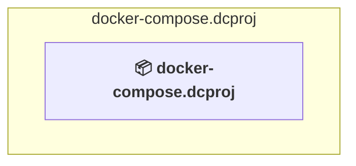

### API Compatibility

| Category | Count | Impact |
| :--- | :---: | :--- |
| 🔴 Binary Incompatible | 0 | High - Require code changes |
| 🟡 Source Incompatible | 0 | Medium - Needs re-compilation and potential conflicting API error fixing |
| 🔵 Behavioral change | 0 | Low - Behavioral changes that may require testing at runtime |
| ✅ Compatible | 0 |  |
| ***Total APIs Analyzed*** | ***0*** |  |

<a id="srcadministrationadministrationcsproj"></a>
### src\Administration\Administration.csproj

#### Project Info

- **Current Target Framework:** net8.0
- **Proposed Target Framework:** net10.0
- **SDK-style**: True
- **Project Kind:** AspNetCore
- **Dependencies**: 2
- **Dependants**: 0
- **Number of Files**: 13
- **Number of Files with Incidents**: 1
- **Lines of Code**: 695
- **Estimated LOC to modify**: 0+ (at least 0.0% of the project)

#### Dependency Graph

Legend:
📦 SDK-style project
⚙️ Classic project

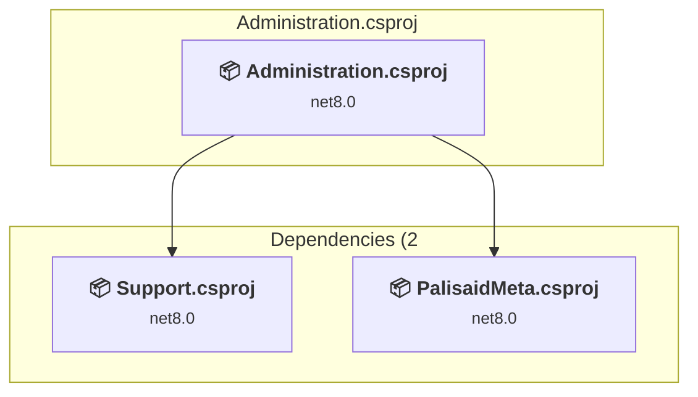

### API Compatibility

| Category | Count | Impact |
| :--- | :---: | :--- |
| 🔴 Binary Incompatible | 0 | High - Require code changes |
| 🟡 Source Incompatible | 0 | Medium - Needs re-compilation and potential conflicting API error fixing |
| 🔵 Behavioral change | 0 | Low - Behavioral changes that may require testing at runtime |
| ✅ Compatible | 656 |  |
| ***Total APIs Analyzed*** | ***656*** |  |

<a id="srcauthenticationauthenticationcsproj"></a>
### src\Authentication\Authentication.csproj

#### Project Info

- **Current Target Framework:** net8.0
- **Proposed Target Framework:** net10.0
- **SDK-style**: True
- **Project Kind:** AspNetCore
- **Dependencies**: 2
- **Dependants**: 0
- **Number of Files**: 8
- **Number of Files with Incidents**: 3
- **Lines of Code**: 1345
- **Estimated LOC to modify**: 35+ (at least 2.6% of the project)

#### Dependency Graph

Legend:
📦 SDK-style project
⚙️ Classic project


### API Compatibility

| Category | Count | Impact |
| :--- | :---: | :--- |
| 🔴 Binary Incompatible | 22 | High - Require code changes |
| 🟡 Source Incompatible | 13 | Medium - Needs re-compilation and potential conflicting API error fixing |
| 🔵 Behavioral change | 0 | Low - Behavioral changes that may require testing at runtime |
| ✅ Compatible | 1870 |  |
| ***Total APIs Analyzed*** | ***1905*** |  |

#### Project Technologies and Features

| Technology | Issues | Percentage | Migration Path |
| :--- | :---: | :---: | :--- |
| IdentityModel & Claims-based Security | 22 | 62.9% | Windows Identity Foundation (WIF), SAML, and claims-based authentication APIs that have been replaced by modern identity libraries. WIF was the original identity framework for .NET Framework. Migrate to Microsoft.IdentityModel.* packages (modern identity stack). |

<a id="srccalendarcalendarcsproj"></a>
### src\Calendar\Calendar.csproj

#### Project Info

- **Current Target Framework:** net8.0
- **Proposed Target Framework:** net10.0
- **SDK-style**: True
- **Project Kind:** AspNetCore
- **Dependencies**: 0
- **Dependants**: 0
- **Number of Files**: 5
- **Number of Files with Incidents**: 1
- **Lines of Code**: 77
- **Estimated LOC to modify**: 0+ (at least 0.0% of the project)

#### Dependency Graph

Legend:
📦 SDK-style project
⚙️ Classic project

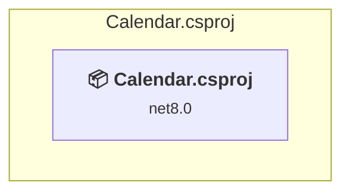

### API Compatibility

| Category | Count | Impact |
| :--- | :---: | :--- |
| 🔴 Binary Incompatible | 0 | High - Require code changes |
| 🟡 Source Incompatible | 0 | Medium - Needs re-compilation and potential conflicting API error fixing |
| 🔵 Behavioral change | 0 | Low - Behavioral changes that may require testing at runtime |
| ✅ Compatible | 108 |  |
| ***Total APIs Analyzed*** | ***108*** |  |

<a id="srccodescodescsproj"></a>
### src\Codes\Codes.csproj

#### Project Info

- **Current Target Framework:** net8.0
- **Proposed Target Framework:** net10.0
- **SDK-style**: True
- **Project Kind:** AspNetCore
- **Dependencies**: 0
- **Dependants**: 0
- **Number of Files**: 5
- **Number of Files with Incidents**: 1
- **Lines of Code**: 77
- **Estimated LOC to modify**: 0+ (at least 0.0% of the project)

#### Dependency Graph

Legend:
📦 SDK-style project
⚙️ Classic project

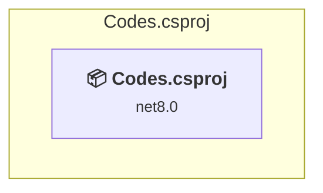

### API Compatibility

| Category | Count | Impact |
| :--- | :---: | :--- |
| 🔴 Binary Incompatible | 0 | High - Require code changes |
| 🟡 Source Incompatible | 0 | Medium - Needs re-compilation and potential conflicting API error fixing |
| 🔵 Behavioral change | 0 | Low - Behavioral changes that may require testing at runtime |
| ✅ Compatible | 108 |  |
| ***Total APIs Analyzed*** | ***108*** |  |

<a id="srccollectorscollectorcollectorcsproj"></a>
### src\Collectors\Collector\Collector.csproj

#### Project Info

- **Current Target Framework:** net8.0
- **Proposed Target Framework:** net10.0
- **SDK-style**: True
- **Project Kind:** AspNetCore
- **Dependencies**: 4
- **Dependants**: 12
- **Number of Files**: 6
- **Number of Files with Incidents**: 1
- **Lines of Code**: 403
- **Estimated LOC to modify**: 0+ (at least 0.0% of the project)

#### Dependency Graph

Legend:
📦 SDK-style project
⚙️ Classic project

```mermaid
flowchart TB
    subgraph upstream["Dependants (12)"]
        P3["<b>📦&nbsp;PopulationHealth.csproj</b><br/><small>net8.0</small>"]
        P8["<b>📦&nbsp;DevTests.csproj</b><br/><small>net8.0</small>"]
        P14["<b>📦&nbsp;X12Collector.csproj</b><br/><small>net8.0</small>"]
        P23["<b>📦&nbsp;Fhir2Collector.csproj</b><br/><small>net8.0</small>"]
        P24["<b>📦&nbsp;Fhir3Collector.csproj</b><br/><small>net8.0</small>"]
        P25["<b>📦&nbsp;Fhir4Collector.csproj</b><br/><small>net8.0</small>"]
        P26["<b>📦&nbsp;Fhir5Collector.csproj</b><br/><small>net8.0</small>"]
        P27["<b>📦&nbsp;Fhir4bCollector.csproj</b><br/><small>net8.0</small>"]
        P30["<b>📦&nbsp;Hl7v2Collector.csproj</b><br/><small>net8.0</small>"]
        P41["<b>📦&nbsp;CollectorFactory.csproj</b><br/><small>net8.0</small>"]
        P43["<b>📦&nbsp;Hl7v3Collector.csproj</b><br/><small>net8.0</small>"]
        P44["<b>📦&nbsp;Hl7CDACollector.csproj</b><br/><small>net8.0</small>"]
        click P3 "#srcpopulationhealthpopulationhealthcsproj"
        click P8 "#testdevtestsdevtestscsproj"
        click P14 "#srccollectorsx12collectorx12collectorcsproj"
        click P23 "#srccollectorsfhir2collectorfhir2collectorcsproj"
        click P24 "#srccollectorsfhir3collectorfhir3collectorcsproj"
        click P25 "#srccollectorsfhir4collectorfhir4collectorcsproj"
        click P26 "#srccollectorsfhir5collectorfhir5collectorcsproj"
        click P27 "#srccollectorsfhir4bcollectorfhir4bcollectorcsproj"
        click P30 "#srccollectorshl7v2collectorhl7v2collectorcsproj"
        click P41 "#srccollectorscollectorfactorycollectorfactorycsproj"
        click P43 "#srccollectorshl7v3collectorhl7v3collectorcsproj"
        click P44 "#srccollectorshl7c-cdacollectorhl7cdacollectorcsproj"
    end
    subgraph current["Collector.csproj"]
        MAIN["<b>📦&nbsp;Collector.csproj</b><br/><small>net8.0</small>"]
        click MAIN "#srccollectorscollectorcollectorcsproj"
    end
    subgraph downstream["Dependencies (4"]
        P11["<b>📦&nbsp;PalisaidMeta.csproj</b><br/><small>net8.0</small>"]
        P47["<b>📦&nbsp;TransformerFactory.csproj</b><br/><small>net8.0</small>"]
        P31["<b>📦&nbsp;Transporter.csproj</b><br/><small>net8.0</small>"]
        P46["<b>📦&nbsp;Transformer.csproj</b><br/><small>net8.0</small>"]
        click P11 "#srcpalisaidmetapalisaidmetacsproj"
        click P47 "#srctransformerstransformerfactorytransformerfactorycsproj"
        click P31 "#srctransporterstransportertransportercsproj"
        click P46 "#srctransformerstransformertransformercsproj"
    end
    P3 --> MAIN
    P8 --> MAIN
    P14 --> MAIN
    P23 --> MAIN
    P24 --> MAIN
    P25 --> MAIN
    P26 --> MAIN
    P27 --> MAIN
    P30 --> MAIN
    P41 --> MAIN
    P43 --> MAIN
    P44 --> MAIN
    MAIN --> P11
    MAIN --> P47
    MAIN --> P31
    MAIN --> P46

```

### API Compatibility

| Category | Count | Impact |
| :--- | :---: | :--- |
| 🔴 Binary Incompatible | 0 | High - Require code changes |
| 🟡 Source Incompatible | 0 | Medium - Needs re-compilation and potential conflicting API error fixing |
| 🔵 Behavioral change | 0 | Low - Behavioral changes that may require testing at runtime |
| ✅ Compatible | 347 |  |
| ***Total APIs Analyzed*** | ***347*** |  |

<a id="srccollectorscollectorfactorycollectorfactorycsproj"></a>
### src\Collectors\CollectorFactory\CollectorFactory.csproj

#### Project Info

- **Current Target Framework:** net8.0
- **Proposed Target Framework:** net10.0
- **SDK-style**: True
- **Project Kind:** ClassLibrary
- **Dependencies**: 11
- **Dependants**: 2
- **Number of Files**: 1
- **Number of Files with Incidents**: 1
- **Lines of Code**: 81
- **Estimated LOC to modify**: 0+ (at least 0.0% of the project)

#### Dependency Graph

Legend:
📦 SDK-style project
⚙️ Classic project

```mermaid
flowchart TB
    subgraph upstream["Dependants (2)"]
        P21["<b>📦&nbsp;CollectorsController.csproj</b><br/><small>net8.0</small>"]
        P42["<b>📦&nbsp;CollectorTests.csproj</b><br/><small>net8.0</small>"]
        click P21 "#srccollectorscollectorscontrollercollectorscontrollercsproj"
        click P42 "#testcollectortestscollectortestscollectortestscsproj"
    end
    subgraph current["CollectorFactory.csproj"]
        MAIN["<b>📦&nbsp;CollectorFactory.csproj</b><br/><small>net8.0</small>"]
        click MAIN "#srccollectorscollectorfactorycollectorfactorycsproj"
    end
    subgraph downstream["Dependencies (11"]
        P14["<b>📦&nbsp;X12Collector.csproj</b><br/><small>net8.0</small>"]
        P13["<b>📦&nbsp;CollectorSupport.csproj</b><br/><small>net8.0</small>"]
        P25["<b>📦&nbsp;Fhir4Collector.csproj</b><br/><small>net8.0</small>"]
        P43["<b>📦&nbsp;Hl7v3Collector.csproj</b><br/><small>net8.0</small>"]
        P44["<b>📦&nbsp;Hl7CDACollector.csproj</b><br/><small>net8.0</small>"]
        P23["<b>📦&nbsp;Fhir2Collector.csproj</b><br/><small>net8.0</small>"]
        P24["<b>📦&nbsp;Fhir3Collector.csproj</b><br/><small>net8.0</small>"]
        P29["<b>📦&nbsp;Collector.csproj</b><br/><small>net8.0</small>"]
        P30["<b>📦&nbsp;Hl7v2Collector.csproj</b><br/><small>net8.0</small>"]
        P26["<b>📦&nbsp;Fhir5Collector.csproj</b><br/><small>net8.0</small>"]
        P27["<b>📦&nbsp;Fhir4bCollector.csproj</b><br/><small>net8.0</small>"]
        click P14 "#srccollectorsx12collectorx12collectorcsproj"
        click P13 "#srccollectorscollectorsupportcollectorsupportcsproj"
        click P25 "#srccollectorsfhir4collectorfhir4collectorcsproj"
        click P43 "#srccollectorshl7v3collectorhl7v3collectorcsproj"
        click P44 "#srccollectorshl7c-cdacollectorhl7cdacollectorcsproj"
        click P23 "#srccollectorsfhir2collectorfhir2collectorcsproj"
        click P24 "#srccollectorsfhir3collectorfhir3collectorcsproj"
        click P29 "#srccollectorscollectorcollectorcsproj"
        click P30 "#srccollectorshl7v2collectorhl7v2collectorcsproj"
        click P26 "#srccollectorsfhir5collectorfhir5collectorcsproj"
        click P27 "#srccollectorsfhir4bcollectorfhir4bcollectorcsproj"
    end
    P21 --> MAIN
    P42 --> MAIN
    MAIN --> P14
    MAIN --> P13
    MAIN --> P25
    MAIN --> P43
    MAIN --> P44
    MAIN --> P23
    MAIN --> P24
    MAIN --> P29
    MAIN --> P30
    MAIN --> P26
    MAIN --> P27

```

### API Compatibility

| Category | Count | Impact |
| :--- | :---: | :--- |
| 🔴 Binary Incompatible | 0 | High - Require code changes |
| 🟡 Source Incompatible | 0 | Medium - Needs re-compilation and potential conflicting API error fixing |
| 🔵 Behavioral change | 0 | Low - Behavioral changes that may require testing at runtime |
| ✅ Compatible | 31 |  |
| ***Total APIs Analyzed*** | ***31*** |  |

<a id="srccollectorscollectorscontrollercollectorscontrollercsproj"></a>
### src\Collectors\CollectorsController\CollectorsController.csproj

#### Project Info

- **Current Target Framework:** net8.0
- **Proposed Target Framework:** net10.0
- **SDK-style**: True
- **Project Kind:** AspNetCore
- **Dependencies**: 4
- **Dependants**: 0
- **Number of Files**: 6
- **Number of Files with Incidents**: 1
- **Lines of Code**: 198
- **Estimated LOC to modify**: 0+ (at least 0.0% of the project)

#### Dependency Graph

Legend:
📦 SDK-style project
⚙️ Classic project

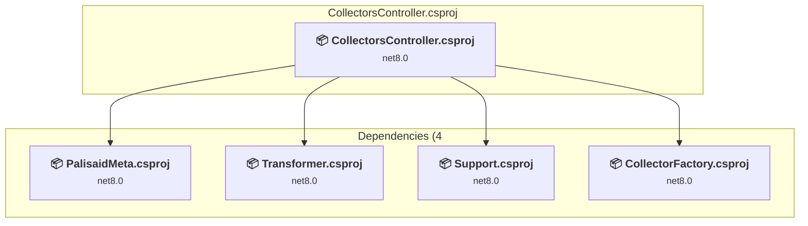

### API Compatibility

| Category | Count | Impact |
| :--- | :---: | :--- |
| 🔴 Binary Incompatible | 0 | High - Require code changes |
| 🟡 Source Incompatible | 0 | Medium - Needs re-compilation and potential conflicting API error fixing |
| 🔵 Behavioral change | 0 | Low - Behavioral changes that may require testing at runtime |
| ✅ Compatible | 237 |  |
| ***Total APIs Analyzed*** | ***237*** |  |

<a id="srccollectorscollectorsupportcollectorsupportcsproj"></a>
### src\Collectors\CollectorSupport\CollectorSupport.csproj

#### Project Info

- **Current Target Framework:** net8.0
- **Proposed Target Framework:** net10.0
- **SDK-style**: True
- **Project Kind:** AspNetCore
- **Dependencies**: 3
- **Dependants**: 1
- **Number of Files**: 17
- **Number of Files with Incidents**: 4
- **Lines of Code**: 853
- **Estimated LOC to modify**: 5+ (at least 0.6% of the project)

#### Dependency Graph

Legend:
📦 SDK-style project
⚙️ Classic project

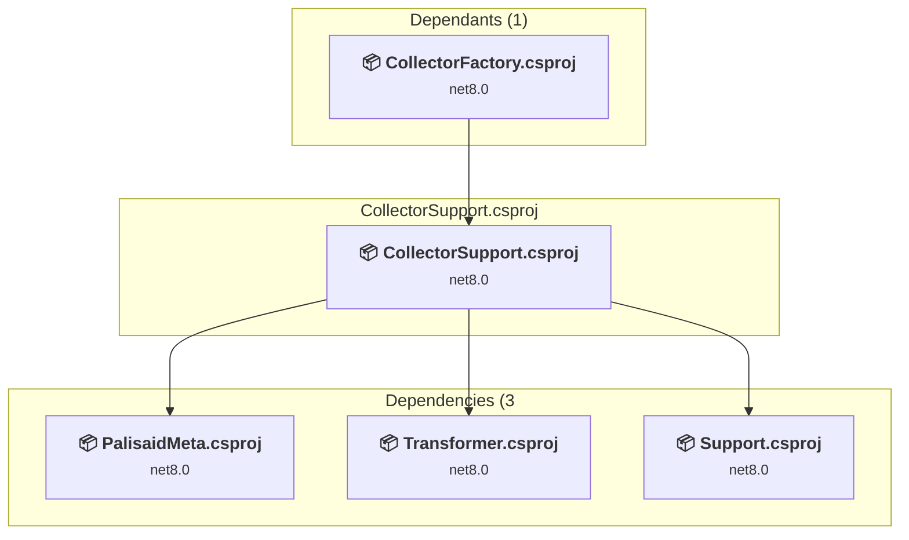

### API Compatibility

| Category | Count | Impact |
| :--- | :---: | :--- |
| 🔴 Binary Incompatible | 0 | High - Require code changes |
| 🟡 Source Incompatible | 0 | Medium - Needs re-compilation and potential conflicting API error fixing |
| 🔵 Behavioral change | 5 | Low - Behavioral changes that may require testing at runtime |
| ✅ Compatible | 975 |  |
| ***Total APIs Analyzed*** | ***980*** |  |

<a id="srccollectorsfhir2collectorfhir2collectorcsproj"></a>
### src\Collectors\Fhir2Collector\Fhir2Collector.csproj

#### Project Info

- **Current Target Framework:** net8.0
- **Proposed Target Framework:** net10.0
- **SDK-style**: True
- **Project Kind:** AspNetCore
- **Dependencies**: 4
- **Dependants**: 1
- **Number of Files**: 5
- **Number of Files with Incidents**: 1
- **Lines of Code**: 219
- **Estimated LOC to modify**: 0+ (at least 0.0% of the project)

#### Dependency Graph

Legend:
📦 SDK-style project
⚙️ Classic project

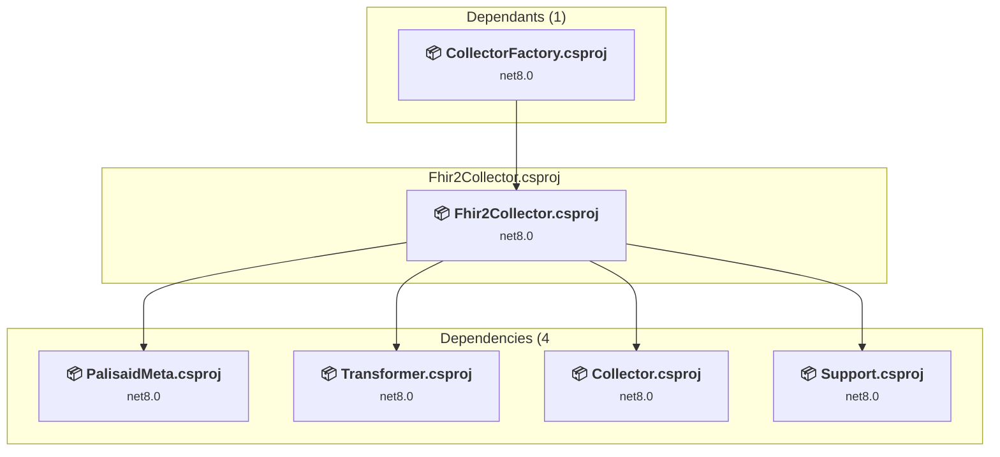

### API Compatibility

| Category | Count | Impact |
| :--- | :---: | :--- |
| 🔴 Binary Incompatible | 0 | High - Require code changes |
| 🟡 Source Incompatible | 0 | Medium - Needs re-compilation and potential conflicting API error fixing |
| 🔵 Behavioral change | 0 | Low - Behavioral changes that may require testing at runtime |
| ✅ Compatible | 213 |  |
| ***Total APIs Analyzed*** | ***213*** |  |

<a id="srccollectorsfhir3collectorfhir3collectorcsproj"></a>
### src\Collectors\Fhir3Collector\Fhir3Collector.csproj

#### Project Info

- **Current Target Framework:** net8.0
- **Proposed Target Framework:** net10.0
- **SDK-style**: True
- **Project Kind:** AspNetCore
- **Dependencies**: 1
- **Dependants**: 1
- **Number of Files**: 4
- **Number of Files with Incidents**: 1
- **Lines of Code**: 105
- **Estimated LOC to modify**: 0+ (at least 0.0% of the project)

#### Dependency Graph

Legend:
📦 SDK-style project
⚙️ Classic project

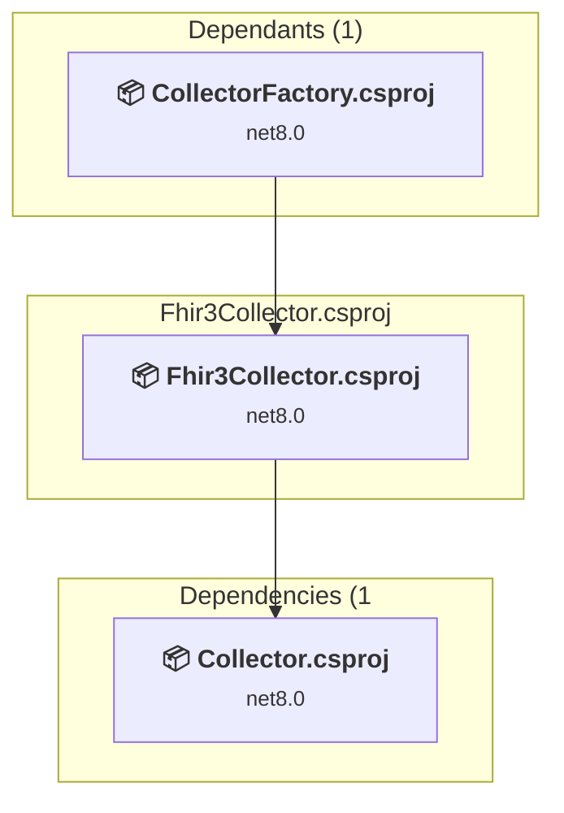

### API Compatibility

| Category | Count | Impact |
| :--- | :---: | :--- |
| 🔴 Binary Incompatible | 0 | High - Require code changes |
| 🟡 Source Incompatible | 0 | Medium - Needs re-compilation and potential conflicting API error fixing |
| 🔵 Behavioral change | 0 | Low - Behavioral changes that may require testing at runtime |
| ✅ Compatible | 86 |  |
| ***Total APIs Analyzed*** | ***86*** |  |

<a id="srccollectorsfhir4bcollectorfhir4bcollectorcsproj"></a>
### src\Collectors\Fhir4bCollector\Fhir4bCollector.csproj

#### Project Info

- **Current Target Framework:** net8.0
- **Proposed Target Framework:** net10.0
- **SDK-style**: True
- **Project Kind:** AspNetCore
- **Dependencies**: 1
- **Dependants**: 1
- **Number of Files**: 4
- **Number of Files with Incidents**: 1
- **Lines of Code**: 105
- **Estimated LOC to modify**: 0+ (at least 0.0% of the project)

#### Dependency Graph

Legend:
📦 SDK-style project
⚙️ Classic project

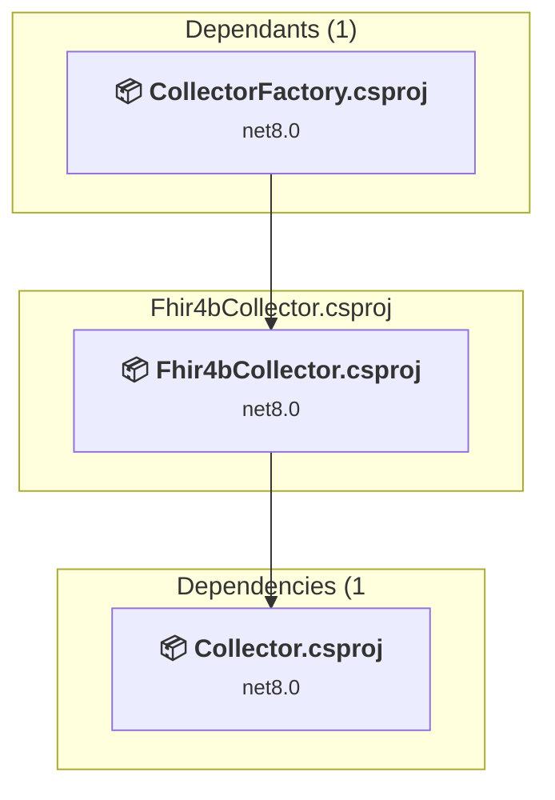

### API Compatibility

| Category | Count | Impact |
| :--- | :---: | :--- |
| 🔴 Binary Incompatible | 0 | High - Require code changes |
| 🟡 Source Incompatible | 0 | Medium - Needs re-compilation and potential conflicting API error fixing |
| 🔵 Behavioral change | 0 | Low - Behavioral changes that may require testing at runtime |
| ✅ Compatible | 86 |  |
| ***Total APIs Analyzed*** | ***86*** |  |

<a id="srccollectorsfhir4collectorfhir4collectorcsproj"></a>
### src\Collectors\Fhir4Collector\Fhir4Collector.csproj

#### Project Info

- **Current Target Framework:** net8.0
- **Proposed Target Framework:** net10.0
- **SDK-style**: True
- **Project Kind:** AspNetCore
- **Dependencies**: 3
- **Dependants**: 1
- **Number of Files**: 7
- **Number of Files with Incidents**: 1
- **Lines of Code**: 213
- **Estimated LOC to modify**: 0+ (at least 0.0% of the project)

#### Dependency Graph

Legend:
📦 SDK-style project
⚙️ Classic project

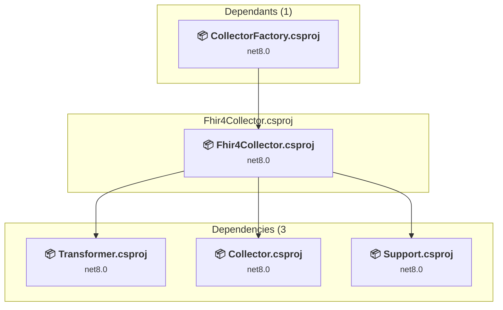

### API Compatibility

| Category | Count | Impact |
| :--- | :---: | :--- |
| 🔴 Binary Incompatible | 0 | High - Require code changes |
| 🟡 Source Incompatible | 0 | Medium - Needs re-compilation and potential conflicting API error fixing |
| 🔵 Behavioral change | 0 | Low - Behavioral changes that may require testing at runtime |
| ✅ Compatible | 217 |  |
| ***Total APIs Analyzed*** | ***217*** |  |

<a id="srccollectorsfhir5collectorfhir5collectorcsproj"></a>
### src\Collectors\Fhir5Collector\Fhir5Collector.csproj

#### Project Info

- **Current Target Framework:** net8.0
- **Proposed Target Framework:** net10.0
- **SDK-style**: True
- **Project Kind:** AspNetCore
- **Dependencies**: 1
- **Dependants**: 1
- **Number of Files**: 5
- **Number of Files with Incidents**: 1
- **Lines of Code**: 107
- **Estimated LOC to modify**: 0+ (at least 0.0% of the project)

#### Dependency Graph

Legend:
📦 SDK-style project
⚙️ Classic project


### API Compatibility

| Category | Count | Impact |
| :--- | :---: | :--- |
| 🔴 Binary Incompatible | 0 | High - Require code changes |
| 🟡 Source Incompatible | 0 | Medium - Needs re-compilation and potential conflicting API error fixing |
| 🔵 Behavioral change | 0 | Low - Behavioral changes that may require testing at runtime |
| ✅ Compatible | 86 |  |
| ***Total APIs Analyzed*** | ***86*** |  |

<a id="srccollectorshl7c-cdacollectorhl7cdacollectorcsproj"></a>
### src\Collectors\Hl7c-CDACollector\Hl7CDACollector.csproj

#### Project Info

- **Current Target Framework:** net8.0
- **Proposed Target Framework:** net10.0
- **SDK-style**: True
- **Project Kind:** AspNetCore
- **Dependencies**: 1
- **Dependants**: 1
- **Number of Files**: 5
- **Number of Files with Incidents**: 1
- **Lines of Code**: 120
- **Estimated LOC to modify**: 0+ (at least 0.0% of the project)

#### Dependency Graph

Legend:
📦 SDK-style project
⚙️ Classic project

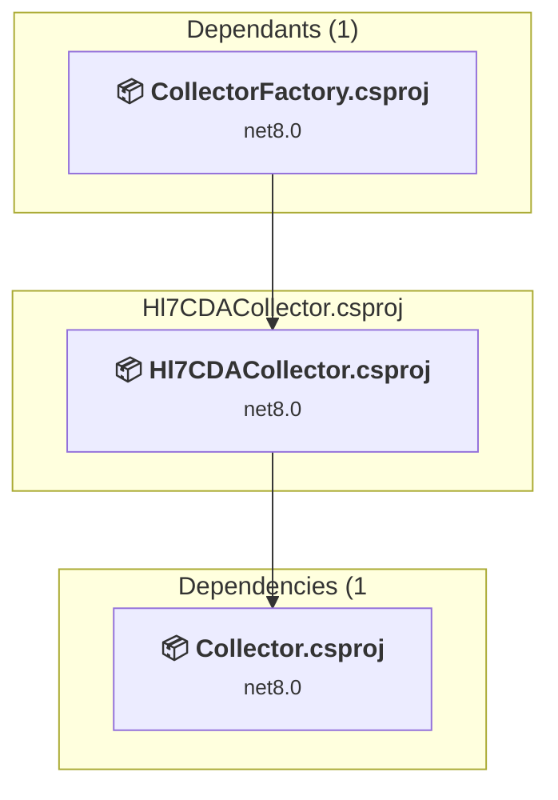

### API Compatibility

| Category | Count | Impact |
| :--- | :---: | :--- |
| 🔴 Binary Incompatible | 0 | High - Require code changes |
| 🟡 Source Incompatible | 0 | Medium - Needs re-compilation and potential conflicting API error fixing |
| 🔵 Behavioral change | 0 | Low - Behavioral changes that may require testing at runtime |
| ✅ Compatible | 91 |  |
| ***Total APIs Analyzed*** | ***91*** |  |

<a id="srccollectorshl7v2collectorhl7v2collectorcsproj"></a>
### src\Collectors\Hl7v2Collector\Hl7v2Collector.csproj

#### Project Info

- **Current Target Framework:** net8.0
- **Proposed Target Framework:** net10.0
- **SDK-style**: True
- **Project Kind:** AspNetCore
- **Dependencies**: 2
- **Dependants**: 1
- **Number of Files**: 5
- **Number of Files with Incidents**: 1
- **Lines of Code**: 124
- **Estimated LOC to modify**: 0+ (at least 0.0% of the project)

#### Dependency Graph

Legend:
📦 SDK-style project
⚙️ Classic project

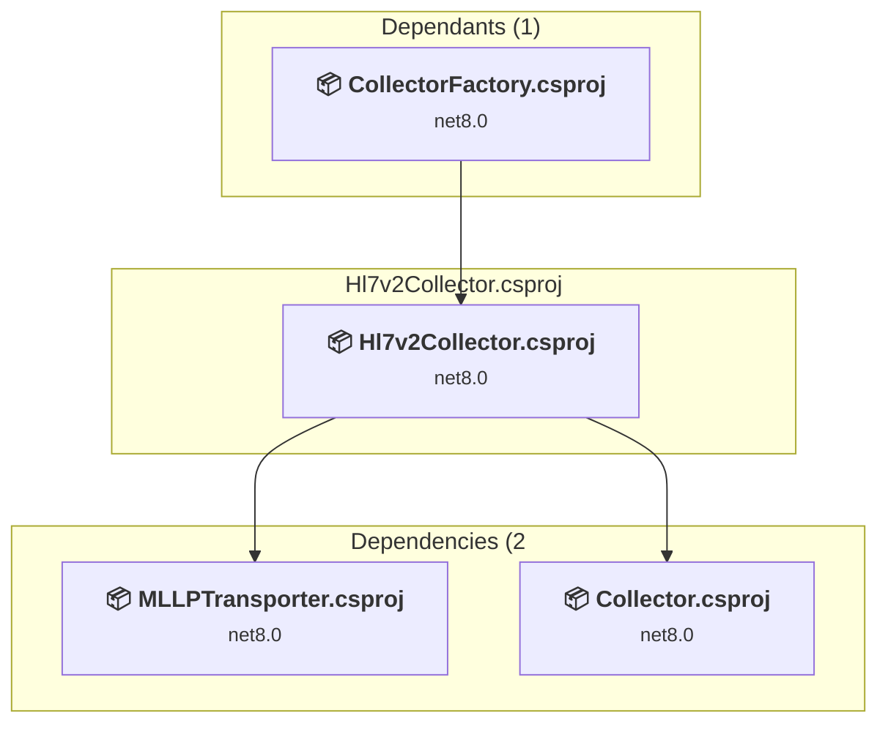

### API Compatibility

| Category | Count | Impact |
| :--- | :---: | :--- |
| 🔴 Binary Incompatible | 0 | High - Require code changes |
| 🟡 Source Incompatible | 0 | Medium - Needs re-compilation and potential conflicting API error fixing |
| 🔵 Behavioral change | 0 | Low - Behavioral changes that may require testing at runtime |
| ✅ Compatible | 141 |  |
| ***Total APIs Analyzed*** | ***141*** |  |

<a id="srccollectorshl7v3collectorhl7v3collectorcsproj"></a>
### src\Collectors\Hl7v3Collector\Hl7v3Collector.csproj

#### Project Info

- **Current Target Framework:** net8.0
- **Proposed Target Framework:** net10.0
- **SDK-style**: True
- **Project Kind:** AspNetCore
- **Dependencies**: 1
- **Dependants**: 1
- **Number of Files**: 5
- **Number of Files with Incidents**: 1
- **Lines of Code**: 120
- **Estimated LOC to modify**: 0+ (at least 0.0% of the project)

#### Dependency Graph

Legend:
📦 SDK-style project
⚙️ Classic project

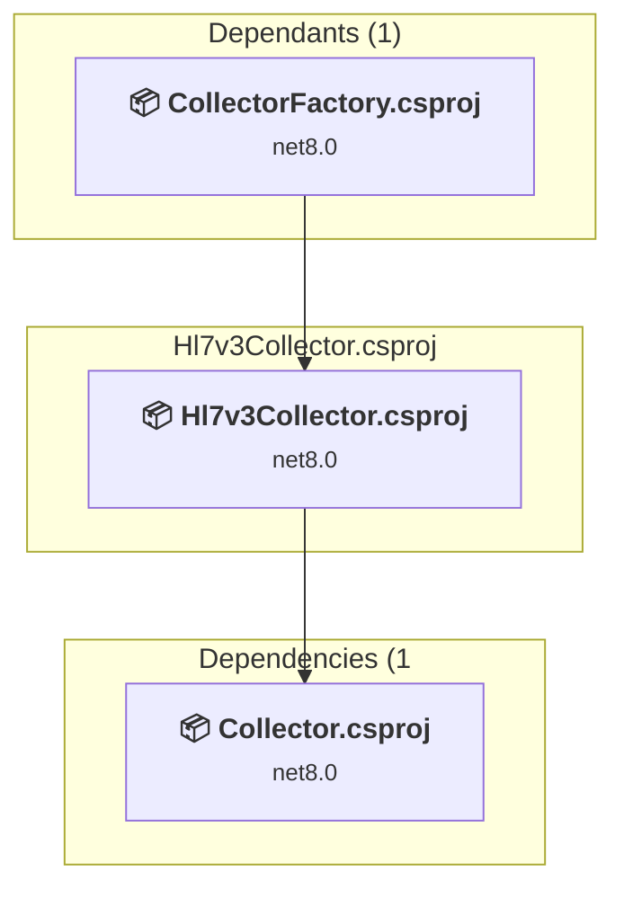

### API Compatibility

| Category | Count | Impact |
| :--- | :---: | :--- |
| 🔴 Binary Incompatible | 0 | High - Require code changes |
| 🟡 Source Incompatible | 0 | Medium - Needs re-compilation and potential conflicting API error fixing |
| 🔵 Behavioral change | 0 | Low - Behavioral changes that may require testing at runtime |
| ✅ Compatible | 91 |  |
| ***Total APIs Analyzed*** | ***91*** |  |

<a id="srccollectorsx12collectorx12collectorcsproj"></a>
### src\Collectors\X12Collector\X12Collector.csproj

#### Project Info

- **Current Target Framework:** net8.0
- **Proposed Target Framework:** net10.0
- **SDK-style**: True
- **Project Kind:** AspNetCore
- **Dependencies**: 1
- **Dependants**: 1
- **Number of Files**: 4
- **Number of Files with Incidents**: 1
- **Lines of Code**: 102
- **Estimated LOC to modify**: 0+ (at least 0.0% of the project)

#### Dependency Graph

Legend:
📦 SDK-style project
⚙️ Classic project

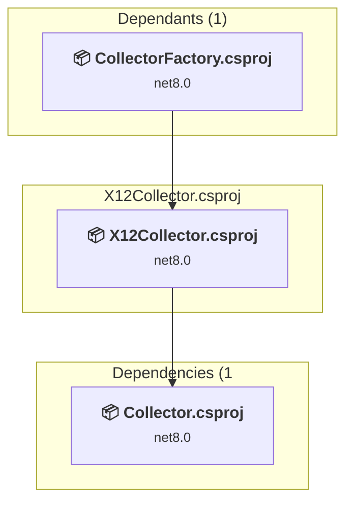

### API Compatibility

| Category | Count | Impact |
| :--- | :---: | :--- |
| 🔴 Binary Incompatible | 0 | High - Require code changes |
| 🟡 Source Incompatible | 0 | Medium - Needs re-compilation and potential conflicting API error fixing |
| 🔵 Behavioral change | 0 | Low - Behavioral changes that may require testing at runtime |
| ✅ Compatible | 86 |  |
| ***Total APIs Analyzed*** | ***86*** |  |

<a id="srcpalisaidmetapalisaidmetacsproj"></a>
### src\PalisaidMeta\PalisaidMeta.csproj

#### Project Info

- **Current Target Framework:** net8.0
- **Proposed Target Framework:** net10.0
- **SDK-style**: True
- **Project Kind:** ClassLibrary
- **Dependencies**: 0
- **Dependants**: 13
- **Number of Files**: 57
- **Number of Files with Incidents**: 5
- **Lines of Code**: 11978
- **Estimated LOC to modify**: 20+ (at least 0.2% of the project)

#### Dependency Graph

Legend:
📦 SDK-style project
⚙️ Classic project

```mermaid
flowchart TB
    subgraph upstream["Dependants (13)"]
        P7["<b>📦&nbsp;IntegrationTests.csproj</b><br/><small>net8.0</small>"]
        P8["<b>📦&nbsp;DevTests.csproj</b><br/><small>net8.0</small>"]
        P9["<b>📦&nbsp;Lists.csproj</b><br/><small>net8.0</small>"]
        P10["<b>📦&nbsp;Administration.csproj</b><br/><small>net8.0</small>"]
        P12["<b>📦&nbsp;Authentication.csproj</b><br/><small>net8.0</small>"]
        P13["<b>📦&nbsp;CollectorSupport.csproj</b><br/><small>net8.0</small>"]
        P21["<b>📦&nbsp;CollectorsController.csproj</b><br/><small>net8.0</small>"]
        P22["<b>📦&nbsp;Support.csproj</b><br/><small>net8.0</small>"]
        P23["<b>📦&nbsp;Fhir2Collector.csproj</b><br/><small>net8.0</small>"]
        P28["<b>📦&nbsp;Primary.csproj</b><br/><small>net8.0</small>"]
        P29["<b>📦&nbsp;Collector.csproj</b><br/><small>net8.0</small>"]
        P46["<b>📦&nbsp;Transformer.csproj</b><br/><small>net8.0</small>"]
        P47["<b>📦&nbsp;TransformerFactory.csproj</b><br/><small>net8.0</small>"]
        click P7 "#testintegrationtestsintegrationtestscsproj"
        click P8 "#testdevtestsdevtestscsproj"
        click P9 "#srcvectorslistscsproj"
        click P10 "#srcadministrationadministrationcsproj"
        click P12 "#srcauthenticationauthenticationcsproj"
        click P13 "#srccollectorscollectorsupportcollectorsupportcsproj"
        click P21 "#srccollectorscollectorscontrollercollectorscontrollercsproj"
        click P22 "#srcsupportsupportcsproj"
        click P23 "#srccollectorsfhir2collectorfhir2collectorcsproj"
        click P28 "#srcprimarycontrollersprimarycsproj"
        click P29 "#srccollectorscollectorcollectorcsproj"
        click P46 "#srctransformerstransformertransformercsproj"
        click P47 "#srctransformerstransformerfactorytransformerfactorycsproj"
    end
    subgraph current["PalisaidMeta.csproj"]
        MAIN["<b>📦&nbsp;PalisaidMeta.csproj</b><br/><small>net8.0</small>"]
        click MAIN "#srcpalisaidmetapalisaidmetacsproj"
    end
    P7 --> MAIN
    P8 --> MAIN
    P9 --> MAIN
    P10 --> MAIN
    P12 --> MAIN
    P13 --> MAIN
    P21 --> MAIN
    P22 --> MAIN
    P23 --> MAIN
    P28 --> MAIN
    P29 --> MAIN
    P46 --> MAIN
    P47 --> MAIN

```

### API Compatibility

| Category | Count | Impact |
| :--- | :---: | :--- |
| 🔴 Binary Incompatible | 0 | High - Require code changes |
| 🟡 Source Incompatible | 0 | Medium - Needs re-compilation and potential conflicting API error fixing |
| 🔵 Behavioral change | 20 | Low - Behavioral changes that may require testing at runtime |
| ✅ Compatible | 15238 |  |
| ***Total APIs Analyzed*** | ***15258*** |  |

<a id="srcpopulationhealthpopulationhealthcsproj"></a>
### src\PopulationHealth\PopulationHealth.csproj

#### Project Info

- **Current Target Framework:** net8.0
- **Proposed Target Framework:** net10.0
- **SDK-style**: True
- **Project Kind:** AspNetCore
- **Dependencies**: 1
- **Dependants**: 0
- **Number of Files**: 4
- **Number of Files with Incidents**: 1
- **Lines of Code**: 105
- **Estimated LOC to modify**: 0+ (at least 0.0% of the project)

#### Dependency Graph

Legend:
📦 SDK-style project
⚙️ Classic project

```mermaid
flowchart TB
    subgraph current["PopulationHealth.csproj"]
        MAIN["<b>📦&nbsp;PopulationHealth.csproj</b><br/><small>net8.0</small>"]
        click MAIN "#srcpopulationhealthpopulationhealthcsproj"
    end
    subgraph downstream["Dependencies (1"]
        P29["<b>📦&nbsp;Collector.csproj</b><br/><small>net8.0</small>"]
        click P29 "#srccollectorscollectorcollectorcsproj"
    end
    MAIN --> P29

```

### API Compatibility

| Category | Count | Impact |
| :--- | :---: | :--- |
| 🔴 Binary Incompatible | 0 | High - Require code changes |
| 🟡 Source Incompatible | 0 | Medium - Needs re-compilation and potential conflicting API error fixing |
| 🔵 Behavioral change | 0 | Low - Behavioral changes that may require testing at runtime |
| ✅ Compatible | 86 |  |
| ***Total APIs Analyzed*** | ***86*** |  |

<a id="srcprimarycontrollersprimarycsproj"></a>
### src\PrimaryControllers\Primary.csproj

#### Project Info

- **Current Target Framework:** net8.0
- **Proposed Target Framework:** net10.0
- **SDK-style**: True
- **Project Kind:** AspNetCore
- **Dependencies**: 2
- **Dependants**: 0
- **Number of Files**: 21
- **Number of Files with Incidents**: 3
- **Lines of Code**: 3716
- **Estimated LOC to modify**: 31+ (at least 0.8% of the project)

#### Dependency Graph

Legend:
📦 SDK-style project
⚙️ Classic project

```mermaid
flowchart TB
    subgraph current["Primary.csproj"]
        MAIN["<b>📦&nbsp;Primary.csproj</b><br/><small>net8.0</small>"]
        click MAIN "#srcprimarycontrollersprimarycsproj"
    end
    subgraph downstream["Dependencies (2"]
        P22["<b>📦&nbsp;Support.csproj</b><br/><small>net8.0</small>"]
        P11["<b>📦&nbsp;PalisaidMeta.csproj</b><br/><small>net8.0</small>"]
        click P22 "#srcsupportsupportcsproj"
        click P11 "#srcpalisaidmetapalisaidmetacsproj"
    end
    MAIN --> P22
    MAIN --> P11

```

### API Compatibility

| Category | Count | Impact |
| :--- | :---: | :--- |
| 🔴 Binary Incompatible | 17 | High - Require code changes |
| 🟡 Source Incompatible | 13 | Medium - Needs re-compilation and potential conflicting API error fixing |
| 🔵 Behavioral change | 1 | Low - Behavioral changes that may require testing at runtime |
| ✅ Compatible | 4852 |  |
| ***Total APIs Analyzed*** | ***4883*** |  |

#### Project Technologies and Features

| Technology | Issues | Percentage | Migration Path |
| :--- | :---: | :---: | :--- |
| IdentityModel & Claims-based Security | 17 | 54.8% | Windows Identity Foundation (WIF), SAML, and claims-based authentication APIs that have been replaced by modern identity libraries. WIF was the original identity framework for .NET Framework. Migrate to Microsoft.IdentityModel.* packages (modern identity stack). |

<a id="srcreportsreportscsproj"></a>
### src\Reports\Reports.csproj

#### Project Info

- **Current Target Framework:** net8.0
- **Proposed Target Framework:** net10.0
- **SDK-style**: True
- **Project Kind:** AspNetCore
- **Dependencies**: 0
- **Dependants**: 0
- **Number of Files**: 5
- **Number of Files with Incidents**: 1
- **Lines of Code**: 77
- **Estimated LOC to modify**: 0+ (at least 0.0% of the project)

#### Dependency Graph

Legend:
📦 SDK-style project
⚙️ Classic project

```mermaid
flowchart TB
    subgraph current["Reports.csproj"]
        MAIN["<b>📦&nbsp;Reports.csproj</b><br/><small>net8.0</small>"]
        click MAIN "#srcreportsreportscsproj"
    end

```

### API Compatibility

| Category | Count | Impact |
| :--- | :---: | :--- |
| 🔴 Binary Incompatible | 0 | High - Require code changes |
| 🟡 Source Incompatible | 0 | Medium - Needs re-compilation and potential conflicting API error fixing |
| 🔵 Behavioral change | 0 | Low - Behavioral changes that may require testing at runtime |
| ✅ Compatible | 108 |  |
| ***Total APIs Analyzed*** | ***108*** |  |

<a id="srcretrieverseligibilityeligibilitycsproj"></a>
### src\Retrievers\Eligibility\Eligibility.csproj

#### Project Info

- **Current Target Framework:** net8.0
- **Proposed Target Framework:** net10.0
- **SDK-style**: True
- **Project Kind:** ClassLibrary
- **Dependencies**: 0
- **Dependants**: 0
- **Number of Files**: 1
- **Number of Files with Incidents**: 1
- **Lines of Code**: 5
- **Estimated LOC to modify**: 0+ (at least 0.0% of the project)

#### Dependency Graph

Legend:
📦 SDK-style project
⚙️ Classic project

```mermaid
flowchart TB
    subgraph current["Eligibility.csproj"]
        MAIN["<b>📦&nbsp;Eligibility.csproj</b><br/><small>net8.0</small>"]
        click MAIN "#srcretrieverseligibilityeligibilitycsproj"
    end

```

### API Compatibility

| Category | Count | Impact |
| :--- | :---: | :--- |
| 🔴 Binary Incompatible | 0 | High - Require code changes |
| 🟡 Source Incompatible | 0 | Medium - Needs re-compilation and potential conflicting API error fixing |
| 🔵 Behavioral change | 0 | Low - Behavioral changes that may require testing at runtime |
| ✅ Compatible | 0 |  |
| ***Total APIs Analyzed*** | ***0*** |  |

<a id="srcretrieversicdicdcsproj"></a>
### src\Retrievers\ICD\ICD.csproj

#### Project Info

- **Current Target Framework:** net8.0
- **Proposed Target Framework:** net10.0
- **SDK-style**: True
- **Project Kind:** ClassLibrary
- **Dependencies**: 0
- **Dependants**: 0
- **Number of Files**: 1
- **Number of Files with Incidents**: 1
- **Lines of Code**: 6
- **Estimated LOC to modify**: 0+ (at least 0.0% of the project)

#### Dependency Graph

Legend:
📦 SDK-style project
⚙️ Classic project

```mermaid
flowchart TB
    subgraph current["ICD.csproj"]
        MAIN["<b>📦&nbsp;ICD.csproj</b><br/><small>net8.0</small>"]
        click MAIN "#srcretrieversicdicdcsproj"
    end

```

### API Compatibility

| Category | Count | Impact |
| :--- | :---: | :--- |
| 🔴 Binary Incompatible | 0 | High - Require code changes |
| 🟡 Source Incompatible | 0 | Medium - Needs re-compilation and potential conflicting API error fixing |
| 🔵 Behavioral change | 0 | Low - Behavioral changes that may require testing at runtime |
| ✅ Compatible | 0 |  |
| ***Total APIs Analyzed*** | ***0*** |  |

<a id="srcretrieversloincloinccsproj"></a>
### src\Retrievers\LOINC\LOINC.csproj

#### Project Info

- **Current Target Framework:** net8.0
- **Proposed Target Framework:** net10.0
- **SDK-style**: True
- **Project Kind:** ClassLibrary
- **Dependencies**: 0
- **Dependants**: 0
- **Number of Files**: 1
- **Number of Files with Incidents**: 1
- **Lines of Code**: 6
- **Estimated LOC to modify**: 0+ (at least 0.0% of the project)

#### Dependency Graph

Legend:
📦 SDK-style project
⚙️ Classic project

```mermaid
flowchart TB
    subgraph current["LOINC.csproj"]
        MAIN["<b>📦&nbsp;LOINC.csproj</b><br/><small>net8.0</small>"]
        click MAIN "#srcretrieversloincloinccsproj"
    end

```

### API Compatibility

| Category | Count | Impact |
| :--- | :---: | :--- |
| 🔴 Binary Incompatible | 0 | High - Require code changes |
| 🟡 Source Incompatible | 0 | Medium - Needs re-compilation and potential conflicting API error fixing |
| 🔵 Behavioral change | 0 | Low - Behavioral changes that may require testing at runtime |
| ✅ Compatible | 0 |  |
| ***Total APIs Analyzed*** | ***0*** |  |

<a id="srcretrieversndcndccsproj"></a>
### src\Retrievers\NDC\NDC.csproj

#### Project Info

- **Current Target Framework:** net8.0
- **Proposed Target Framework:** net10.0
- **SDK-style**: True
- **Project Kind:** ClassLibrary
- **Dependencies**: 0
- **Dependants**: 0
- **Number of Files**: 1
- **Number of Files with Incidents**: 1
- **Lines of Code**: 5
- **Estimated LOC to modify**: 0+ (at least 0.0% of the project)

#### Dependency Graph

Legend:
📦 SDK-style project
⚙️ Classic project

```mermaid
flowchart TB
    subgraph current["NDC.csproj"]
        MAIN["<b>📦&nbsp;NDC.csproj</b><br/><small>net8.0</small>"]
        click MAIN "#srcretrieversndcndccsproj"
    end

```

### API Compatibility

| Category | Count | Impact |
| :--- | :---: | :--- |
| 🔴 Binary Incompatible | 0 | High - Require code changes |
| 🟡 Source Incompatible | 0 | Medium - Needs re-compilation and potential conflicting API error fixing |
| 🔵 Behavioral change | 0 | Low - Behavioral changes that may require testing at runtime |
| ✅ Compatible | 0 |  |
| ***Total APIs Analyzed*** | ***0*** |  |

<a id="srcretrieversretrieverretrievercsproj"></a>
### src\Retrievers\Retriever\Retriever.csproj

#### Project Info

- **Current Target Framework:** net6.0
- **Proposed Target Framework:** net10.0
- **SDK-style**: True
- **Project Kind:** ClassLibrary
- **Dependencies**: 0
- **Dependants**: 0
- **Number of Files**: 1
- **Number of Files with Incidents**: 1
- **Lines of Code**: 5
- **Estimated LOC to modify**: 0+ (at least 0.0% of the project)

#### Dependency Graph

Legend:
📦 SDK-style project
⚙️ Classic project

```mermaid
flowchart TB
    subgraph current["Retriever.csproj"]
        MAIN["<b>📦&nbsp;Retriever.csproj</b><br/><small>net6.0</small>"]
        click MAIN "#srcretrieversretrieverretrievercsproj"
    end

```

### API Compatibility

| Category | Count | Impact |
| :--- | :---: | :--- |
| 🔴 Binary Incompatible | 0 | High - Require code changes |
| 🟡 Source Incompatible | 0 | Medium - Needs re-compilation and potential conflicting API error fixing |
| 🔵 Behavioral change | 0 | Low - Behavioral changes that may require testing at runtime |
| ✅ Compatible | 0 |  |
| ***Total APIs Analyzed*** | ***0*** |  |

<a id="srcretrieversretrievercontrollerretrievercontrollercsproj"></a>
### src\Retrievers\RetrieverController\RetrieverController.csproj

#### Project Info

- **Current Target Framework:** net6.0
- **Proposed Target Framework:** net10.0
- **SDK-style**: True
- **Project Kind:** AspNetCore
- **Dependencies**: 0
- **Dependants**: 0
- **Number of Files**: 3
- **Number of Files with Incidents**: 1
- **Lines of Code**: 43
- **Estimated LOC to modify**: 0+ (at least 0.0% of the project)

#### Dependency Graph

Legend:
📦 SDK-style project
⚙️ Classic project

```mermaid
flowchart TB
    subgraph current["RetrieverController.csproj"]
        MAIN["<b>📦&nbsp;RetrieverController.csproj</b><br/><small>net6.0</small>"]
        click MAIN "#srcretrieversretrievercontrollerretrievercontrollercsproj"
    end

```

### API Compatibility

| Category | Count | Impact |
| :--- | :---: | :--- |
| 🔴 Binary Incompatible | 0 | High - Require code changes |
| 🟡 Source Incompatible | 0 | Medium - Needs re-compilation and potential conflicting API error fixing |
| 🔵 Behavioral change | 0 | Low - Behavioral changes that may require testing at runtime |
| ✅ Compatible | 99 |  |
| ***Total APIs Analyzed*** | ***99*** |  |

<a id="srcretrieversretrieverfactoryretrieverfactorycsproj"></a>
### src\Retrievers\RetrieverFactory\RetrieverFactory.csproj

#### Project Info

- **Current Target Framework:** net6.0
- **Proposed Target Framework:** net10.0
- **SDK-style**: True
- **Project Kind:** ClassLibrary
- **Dependencies**: 0
- **Dependants**: 0
- **Number of Files**: 1
- **Number of Files with Incidents**: 1
- **Lines of Code**: 5
- **Estimated LOC to modify**: 0+ (at least 0.0% of the project)

#### Dependency Graph

Legend:
📦 SDK-style project
⚙️ Classic project

```mermaid
flowchart TB
    subgraph current["RetrieverFactory.csproj"]
        MAIN["<b>📦&nbsp;RetrieverFactory.csproj</b><br/><small>net6.0</small>"]
        click MAIN "#srcretrieversretrieverfactoryretrieverfactorycsproj"
    end

```

### API Compatibility

| Category | Count | Impact |
| :--- | :---: | :--- |
| 🔴 Binary Incompatible | 0 | High - Require code changes |
| 🟡 Source Incompatible | 0 | Medium - Needs re-compilation and potential conflicting API error fixing |
| 🔵 Behavioral change | 0 | Low - Behavioral changes that may require testing at runtime |
| ✅ Compatible | 0 |  |
| ***Total APIs Analyzed*** | ***0*** |  |

<a id="srcretrieverssnomedsnomedcsproj"></a>
### src\Retrievers\SNOMED\SNOMED.csproj

#### Project Info

- **Current Target Framework:** net8.0
- **Proposed Target Framework:** net10.0
- **SDK-style**: True
- **Project Kind:** ClassLibrary
- **Dependencies**: 0
- **Dependants**: 0
- **Number of Files**: 1
- **Number of Files with Incidents**: 1
- **Lines of Code**: 5
- **Estimated LOC to modify**: 0+ (at least 0.0% of the project)

#### Dependency Graph

Legend:
📦 SDK-style project
⚙️ Classic project

```mermaid
flowchart TB
    subgraph current["SNOMED.csproj"]
        MAIN["<b>📦&nbsp;SNOMED.csproj</b><br/><small>net8.0</small>"]
        click MAIN "#srcretrieverssnomedsnomedcsproj"
    end

```

### API Compatibility

| Category | Count | Impact |
| :--- | :---: | :--- |
| 🔴 Binary Incompatible | 0 | High - Require code changes |
| 🟡 Source Incompatible | 0 | Medium - Needs re-compilation and potential conflicting API error fixing |
| 🔵 Behavioral change | 0 | Low - Behavioral changes that may require testing at runtime |
| ✅ Compatible | 0 |  |
| ***Total APIs Analyzed*** | ***0*** |  |

<a id="srcsupportsupportcsproj"></a>
### src\Support\Support.csproj

#### Project Info

- **Current Target Framework:** net8.0
- **Proposed Target Framework:** net10.0
- **SDK-style**: True
- **Project Kind:** ClassLibrary
- **Dependencies**: 1
- **Dependants**: 20
- **Number of Files**: 21
- **Number of Files with Incidents**: 3
- **Lines of Code**: 1418
- **Estimated LOC to modify**: 6+ (at least 0.4% of the project)

#### Dependency Graph

Legend:
📦 SDK-style project
⚙️ Classic project

```mermaid
flowchart TB
    subgraph upstream["Dependants (20)"]
        P7["<b>📦&nbsp;IntegrationTests.csproj</b><br/><small>net8.0</small>"]
        P9["<b>📦&nbsp;Lists.csproj</b><br/><small>net8.0</small>"]
        P10["<b>📦&nbsp;Administration.csproj</b><br/><small>net8.0</small>"]
        P12["<b>📦&nbsp;Authentication.csproj</b><br/><small>net8.0</small>"]
        P13["<b>📦&nbsp;CollectorSupport.csproj</b><br/><small>net8.0</small>"]
        P21["<b>📦&nbsp;CollectorsController.csproj</b><br/><small>net8.0</small>"]
        P23["<b>📦&nbsp;Fhir2Collector.csproj</b><br/><small>net8.0</small>"]
        P25["<b>📦&nbsp;Fhir4Collector.csproj</b><br/><small>net8.0</small>"]
        P28["<b>📦&nbsp;Primary.csproj</b><br/><small>net8.0</small>"]
        P31["<b>📦&nbsp;Transporter.csproj</b><br/><small>net8.0</small>"]
        P32["<b>📦&nbsp;MLLPTransporter.csproj</b><br/><small>net8.0</small>"]
        P34["<b>📦&nbsp;TCPIPTransporter.csproj</b><br/><small>net8.0</small>"]
        P35["<b>📦&nbsp;RESTTransporter.csproj</b><br/><small>net8.0</small>"]
        P36["<b>📦&nbsp;Fhir2Transporter.csproj</b><br/><small>net8.0</small>"]
        P37["<b>📦&nbsp;Fhir3Transporter.csproj</b><br/><small>net8.0</small>"]
        P38["<b>📦&nbsp;Fhir4Transporter.csproj</b><br/><small>net8.0</small>"]
        P39["<b>📦&nbsp;Fhir5Transporter.csproj</b><br/><small>net8.0</small>"]
        P40["<b>📦&nbsp;Fhir4bTransporter.csproj</b><br/><small>net8.0</small>"]
        P46["<b>📦&nbsp;Transformer.csproj</b><br/><small>net8.0</small>"]
        P47["<b>📦&nbsp;TransformerFactory.csproj</b><br/><small>net8.0</small>"]
        click P7 "#testintegrationtestsintegrationtestscsproj"
        click P9 "#srcvectorslistscsproj"
        click P10 "#srcadministrationadministrationcsproj"
        click P12 "#srcauthenticationauthenticationcsproj"
        click P13 "#srccollectorscollectorsupportcollectorsupportcsproj"
        click P21 "#srccollectorscollectorscontrollercollectorscontrollercsproj"
        click P23 "#srccollectorsfhir2collectorfhir2collectorcsproj"
        click P25 "#srccollectorsfhir4collectorfhir4collectorcsproj"
        click P28 "#srcprimarycontrollersprimarycsproj"
        click P31 "#srctransporterstransportertransportercsproj"
        click P32 "#srctransportersmllptransportermllptransportercsproj"
        click P34 "#srctransporterstcpiptransportertcpiptransportercsproj"
        click P35 "#srctransportersresttransporterresttransportercsproj"
        click P36 "#srctransportersfhir2transporterfhir2transportercsproj"
        click P37 "#srctransportersfhir3transporterfhir3transportercsproj"
        click P38 "#srctransportersfhir4transporterfhir4transportercsproj"
        click P39 "#srctransportersfhir5transporterfhir5transportercsproj"
        click P40 "#srctransportersfhir4btransporterfhir4btransportercsproj"
        click P46 "#srctransformerstransformertransformercsproj"
        click P47 "#srctransformerstransformerfactorytransformerfactorycsproj"
    end
    subgraph current["Support.csproj"]
        MAIN["<b>📦&nbsp;Support.csproj</b><br/><small>net8.0</small>"]
        click MAIN "#srcsupportsupportcsproj"
    end
    subgraph downstream["Dependencies (1"]
        P11["<b>📦&nbsp;PalisaidMeta.csproj</b><br/><small>net8.0</small>"]
        click P11 "#srcpalisaidmetapalisaidmetacsproj"
    end
    P7 --> MAIN
    P9 --> MAIN
    P10 --> MAIN
    P12 --> MAIN
    P13 --> MAIN
    P21 --> MAIN
    P23 --> MAIN
    P25 --> MAIN
    P28 --> MAIN
    P31 --> MAIN
    P32 --> MAIN
    P34 --> MAIN
    P35 --> MAIN
    P36 --> MAIN
    P37 --> MAIN
    P38 --> MAIN
    P39 --> MAIN
    P40 --> MAIN
    P46 --> MAIN
    P47 --> MAIN
    MAIN --> P11

```

### API Compatibility

| Category | Count | Impact |
| :--- | :---: | :--- |
| 🔴 Binary Incompatible | 4 | High - Require code changes |
| 🟡 Source Incompatible | 0 | Medium - Needs re-compilation and potential conflicting API error fixing |
| 🔵 Behavioral change | 2 | Low - Behavioral changes that may require testing at runtime |
| ✅ Compatible | 1261 |  |
| ***Total APIs Analyzed*** | ***1267*** |  |

#### Project Technologies and Features

| Technology | Issues | Percentage | Migration Path |
| :--- | :---: | :---: | :--- |
| IdentityModel & Claims-based Security | 4 | 66.7% | Windows Identity Foundation (WIF), SAML, and claims-based authentication APIs that have been replaced by modern identity libraries. WIF was the original identity framework for .NET Framework. Migrate to Microsoft.IdentityModel.* packages (modern identity stack). |

<a id="srctransformershl7fhirtransformerhl7fhirtransformercsproj"></a>
### src\Transformers\HL7FhirTransformer\HL7FhirTransformer.csproj

#### Project Info

- **Current Target Framework:** net8.0
- **Proposed Target Framework:** net10.0
- **SDK-style**: True
- **Project Kind:** ClassLibrary
- **Dependencies**: 0
- **Dependants**: 0
- **Number of Files**: 0
- **Number of Files with Incidents**: 1
- **Lines of Code**: 0
- **Estimated LOC to modify**: 0+ (at least 0.0% of the project)

#### Dependency Graph

Legend:
📦 SDK-style project
⚙️ Classic project

```mermaid
flowchart TB
    subgraph current["HL7FhirTransformer.csproj"]
        MAIN["<b>📦&nbsp;HL7FhirTransformer.csproj</b><br/><small>net8.0</small>"]
        click MAIN "#srctransformershl7fhirtransformerhl7fhirtransformercsproj"
    end

```

### API Compatibility

| Category | Count | Impact |
| :--- | :---: | :--- |
| 🔴 Binary Incompatible | 0 | High - Require code changes |
| 🟡 Source Incompatible | 0 | Medium - Needs re-compilation and potential conflicting API error fixing |
| 🔵 Behavioral change | 0 | Low - Behavioral changes that may require testing at runtime |
| ✅ Compatible | 0 |  |
| ***Total APIs Analyzed*** | ***0*** |  |

<a id="srctransformershl7v2transformerhl7v2transformercsproj"></a>
### src\Transformers\HL7v2Transformer\HL7v2Transformer.csproj

#### Project Info

- **Current Target Framework:** net8.0
- **Proposed Target Framework:** net10.0
- **SDK-style**: True
- **Project Kind:** ClassLibrary
- **Dependencies**: 0
- **Dependants**: 0
- **Number of Files**: 1
- **Number of Files with Incidents**: 1
- **Lines of Code**: 5
- **Estimated LOC to modify**: 0+ (at least 0.0% of the project)

#### Dependency Graph

Legend:
📦 SDK-style project
⚙️ Classic project

```mermaid
flowchart TB
    subgraph current["HL7v2Transformer.csproj"]
        MAIN["<b>📦&nbsp;HL7v2Transformer.csproj</b><br/><small>net8.0</small>"]
        click MAIN "#srctransformershl7v2transformerhl7v2transformercsproj"
    end

```

### API Compatibility

| Category | Count | Impact |
| :--- | :---: | :--- |
| 🔴 Binary Incompatible | 0 | High - Require code changes |
| 🟡 Source Incompatible | 0 | Medium - Needs re-compilation and potential conflicting API error fixing |
| 🔵 Behavioral change | 0 | Low - Behavioral changes that may require testing at runtime |
| ✅ Compatible | 0 |  |
| ***Total APIs Analyzed*** | ***0*** |  |

<a id="srctransformerstransformertransformercsproj"></a>
### src\Transformers\Transformer\Transformer.csproj

#### Project Info

- **Current Target Framework:** net8.0
- **Proposed Target Framework:** net10.0
- **SDK-style**: True
- **Project Kind:** ClassLibrary
- **Dependencies**: 3
- **Dependants**: 6
- **Number of Files**: 4
- **Number of Files with Incidents**: 1
- **Lines of Code**: 833
- **Estimated LOC to modify**: 0+ (at least 0.0% of the project)

#### Dependency Graph

Legend:
📦 SDK-style project
⚙️ Classic project

```mermaid
flowchart TB
    subgraph upstream["Dependants (6)"]
        P8["<b>📦&nbsp;DevTests.csproj</b><br/><small>net8.0</small>"]
        P13["<b>📦&nbsp;CollectorSupport.csproj</b><br/><small>net8.0</small>"]
        P21["<b>📦&nbsp;CollectorsController.csproj</b><br/><small>net8.0</small>"]
        P23["<b>📦&nbsp;Fhir2Collector.csproj</b><br/><small>net8.0</small>"]
        P25["<b>📦&nbsp;Fhir4Collector.csproj</b><br/><small>net8.0</small>"]
        P29["<b>📦&nbsp;Collector.csproj</b><br/><small>net8.0</small>"]
        click P8 "#testdevtestsdevtestscsproj"
        click P13 "#srccollectorscollectorsupportcollectorsupportcsproj"
        click P21 "#srccollectorscollectorscontrollercollectorscontrollercsproj"
        click P23 "#srccollectorsfhir2collectorfhir2collectorcsproj"
        click P25 "#srccollectorsfhir4collectorfhir4collectorcsproj"
        click P29 "#srccollectorscollectorcollectorcsproj"
    end
    subgraph current["Transformer.csproj"]
        MAIN["<b>📦&nbsp;Transformer.csproj</b><br/><small>net8.0</small>"]
        click MAIN "#srctransformerstransformertransformercsproj"
    end
    subgraph downstream["Dependencies (3"]
        P11["<b>📦&nbsp;PalisaidMeta.csproj</b><br/><small>net8.0</small>"]
        P47["<b>📦&nbsp;TransformerFactory.csproj</b><br/><small>net8.0</small>"]
        P22["<b>📦&nbsp;Support.csproj</b><br/><small>net8.0</small>"]
        click P11 "#srcpalisaidmetapalisaidmetacsproj"
        click P47 "#srctransformerstransformerfactorytransformerfactorycsproj"
        click P22 "#srcsupportsupportcsproj"
    end
    P8 --> MAIN
    P13 --> MAIN
    P21 --> MAIN
    P23 --> MAIN
    P25 --> MAIN
    P29 --> MAIN
    MAIN --> P11
    MAIN --> P47
    MAIN --> P22

```

### API Compatibility

| Category | Count | Impact |
| :--- | :---: | :--- |
| 🔴 Binary Incompatible | 0 | High - Require code changes |
| 🟡 Source Incompatible | 0 | Medium - Needs re-compilation and potential conflicting API error fixing |
| 🔵 Behavioral change | 0 | Low - Behavioral changes that may require testing at runtime |
| ✅ Compatible | 252 |  |
| ***Total APIs Analyzed*** | ***252*** |  |

<a id="srctransformerstransformercontrolertransformercontrolercsproj"></a>
### src\Transformers\TransformerControler\TransformerControler.csproj

#### Project Info

- **Current Target Framework:** net6.0
- **Proposed Target Framework:** net10.0
- **SDK-style**: True
- **Project Kind:** AspNetCore
- **Dependencies**: 0
- **Dependants**: 0
- **Number of Files**: 3
- **Number of Files with Incidents**: 1
- **Lines of Code**: 43
- **Estimated LOC to modify**: 0+ (at least 0.0% of the project)

#### Dependency Graph

Legend:
📦 SDK-style project
⚙️ Classic project

```mermaid
flowchart TB
    subgraph current["TransformerControler.csproj"]
        MAIN["<b>📦&nbsp;TransformerControler.csproj</b><br/><small>net6.0</small>"]
        click MAIN "#srctransformerstransformercontrolertransformercontrolercsproj"
    end

```

### API Compatibility

| Category | Count | Impact |
| :--- | :---: | :--- |
| 🔴 Binary Incompatible | 0 | High - Require code changes |
| 🟡 Source Incompatible | 0 | Medium - Needs re-compilation and potential conflicting API error fixing |
| 🔵 Behavioral change | 0 | Low - Behavioral changes that may require testing at runtime |
| ✅ Compatible | 99 |  |
| ***Total APIs Analyzed*** | ***99*** |  |

<a id="srctransformerstransformerfactorytransformerfactorycsproj"></a>
### src\Transformers\TransformerFactory\TransformerFactory.csproj

#### Project Info

- **Current Target Framework:** net8.0
- **Proposed Target Framework:** net10.0
- **SDK-style**: True
- **Project Kind:** ClassLibrary
- **Dependencies**: 2
- **Dependants**: 2
- **Number of Files**: 42
- **Number of Files with Incidents**: 4
- **Lines of Code**: 7229
- **Estimated LOC to modify**: 3+ (at least 0.0% of the project)

#### Dependency Graph

Legend:
📦 SDK-style project
⚙️ Classic project

```mermaid
flowchart TB
    subgraph upstream["Dependants (2)"]
        P29["<b>📦&nbsp;Collector.csproj</b><br/><small>net8.0</small>"]
        P46["<b>📦&nbsp;Transformer.csproj</b><br/><small>net8.0</small>"]
        click P29 "#srccollectorscollectorcollectorcsproj"
        click P46 "#srctransformerstransformertransformercsproj"
    end
    subgraph current["TransformerFactory.csproj"]
        MAIN["<b>📦&nbsp;TransformerFactory.csproj</b><br/><small>net8.0</small>"]
        click MAIN "#srctransformerstransformerfactorytransformerfactorycsproj"
    end
    subgraph downstream["Dependencies (2"]
        P11["<b>📦&nbsp;PalisaidMeta.csproj</b><br/><small>net8.0</small>"]
        P22["<b>📦&nbsp;Support.csproj</b><br/><small>net8.0</small>"]
        click P11 "#srcpalisaidmetapalisaidmetacsproj"
        click P22 "#srcsupportsupportcsproj"
    end
    P29 --> MAIN
    P46 --> MAIN
    MAIN --> P11
    MAIN --> P22

```

### API Compatibility

| Category | Count | Impact |
| :--- | :---: | :--- |
| 🔴 Binary Incompatible | 0 | High - Require code changes |
| 🟡 Source Incompatible | 0 | Medium - Needs re-compilation and potential conflicting API error fixing |
| 🔵 Behavioral change | 3 | Low - Behavioral changes that may require testing at runtime |
| ✅ Compatible | 6257 |  |
| ***Total APIs Analyzed*** | ***6260*** |  |

<a id="srctransformersx12transformerx12transformercsproj"></a>
### src\Transformers\X12Transformer\X12Transformer.csproj

#### Project Info

- **Current Target Framework:** net8.0
- **Proposed Target Framework:** net10.0
- **SDK-style**: True
- **Project Kind:** ClassLibrary
- **Dependencies**: 0
- **Dependants**: 0
- **Number of Files**: 1
- **Number of Files with Incidents**: 1
- **Lines of Code**: 5
- **Estimated LOC to modify**: 0+ (at least 0.0% of the project)

#### Dependency Graph

Legend:
📦 SDK-style project
⚙️ Classic project

```mermaid
flowchart TB
    subgraph current["X12Transformer.csproj"]
        MAIN["<b>📦&nbsp;X12Transformer.csproj</b><br/><small>net8.0</small>"]
        click MAIN "#srctransformersx12transformerx12transformercsproj"
    end

```

### API Compatibility

| Category | Count | Impact |
| :--- | :---: | :--- |
| 🔴 Binary Incompatible | 0 | High - Require code changes |
| 🟡 Source Incompatible | 0 | Medium - Needs re-compilation and potential conflicting API error fixing |
| 🔵 Behavioral change | 0 | Low - Behavioral changes that may require testing at runtime |
| ✅ Compatible | 0 |  |
| ***Total APIs Analyzed*** | ***0*** |  |

<a id="srctransportersfhir2transporterfhir2transportercsproj"></a>
### src\Transporters\Fhir2Transporter\Fhir2Transporter.csproj

#### Project Info

- **Current Target Framework:** net8.0
- **Proposed Target Framework:** net10.0
- **SDK-style**: True
- **Project Kind:** ClassLibrary
- **Dependencies**: 2
- **Dependants**: 0
- **Number of Files**: 1
- **Number of Files with Incidents**: 2
- **Lines of Code**: 81
- **Estimated LOC to modify**: 3+ (at least 3.7% of the project)

#### Dependency Graph

Legend:
📦 SDK-style project
⚙️ Classic project

```mermaid
flowchart TB
    subgraph current["Fhir2Transporter.csproj"]
        MAIN["<b>📦&nbsp;Fhir2Transporter.csproj</b><br/><small>net8.0</small>"]
        click MAIN "#srctransportersfhir2transporterfhir2transportercsproj"
    end
    subgraph downstream["Dependencies (2"]
        P31["<b>📦&nbsp;Transporter.csproj</b><br/><small>net8.0</small>"]
        P22["<b>📦&nbsp;Support.csproj</b><br/><small>net8.0</small>"]
        click P31 "#srctransporterstransportertransportercsproj"
        click P22 "#srcsupportsupportcsproj"
    end
    MAIN --> P31
    MAIN --> P22

```

### API Compatibility

| Category | Count | Impact |
| :--- | :---: | :--- |
| 🔴 Binary Incompatible | 0 | High - Require code changes |
| 🟡 Source Incompatible | 0 | Medium - Needs re-compilation and potential conflicting API error fixing |
| 🔵 Behavioral change | 3 | Low - Behavioral changes that may require testing at runtime |
| ✅ Compatible | 73 |  |
| ***Total APIs Analyzed*** | ***76*** |  |

<a id="srctransportersfhir3transporterfhir3transportercsproj"></a>
### src\Transporters\Fhir3Transporter\Fhir3Transporter.csproj

#### Project Info

- **Current Target Framework:** net8.0
- **Proposed Target Framework:** net10.0
- **SDK-style**: True
- **Project Kind:** ClassLibrary
- **Dependencies**: 2
- **Dependants**: 0
- **Number of Files**: 1
- **Number of Files with Incidents**: 1
- **Lines of Code**: 6
- **Estimated LOC to modify**: 0+ (at least 0.0% of the project)

#### Dependency Graph

Legend:
📦 SDK-style project
⚙️ Classic project

```mermaid
flowchart TB
    subgraph current["Fhir3Transporter.csproj"]
        MAIN["<b>📦&nbsp;Fhir3Transporter.csproj</b><br/><small>net8.0</small>"]
        click MAIN "#srctransportersfhir3transporterfhir3transportercsproj"
    end
    subgraph downstream["Dependencies (2"]
        P31["<b>📦&nbsp;Transporter.csproj</b><br/><small>net8.0</small>"]
        P22["<b>📦&nbsp;Support.csproj</b><br/><small>net8.0</small>"]
        click P31 "#srctransporterstransportertransportercsproj"
        click P22 "#srcsupportsupportcsproj"
    end
    MAIN --> P31
    MAIN --> P22

```

### API Compatibility

| Category | Count | Impact |
| :--- | :---: | :--- |
| 🔴 Binary Incompatible | 0 | High - Require code changes |
| 🟡 Source Incompatible | 0 | Medium - Needs re-compilation and potential conflicting API error fixing |
| 🔵 Behavioral change | 0 | Low - Behavioral changes that may require testing at runtime |
| ✅ Compatible | 0 |  |
| ***Total APIs Analyzed*** | ***0*** |  |

<a id="srctransportersfhir4btransporterfhir4btransportercsproj"></a>
### src\Transporters\Fhir4bTransporter\Fhir4bTransporter.csproj

#### Project Info

- **Current Target Framework:** net8.0
- **Proposed Target Framework:** net10.0
- **SDK-style**: True
- **Project Kind:** ClassLibrary
- **Dependencies**: 2
- **Dependants**: 0
- **Number of Files**: 1
- **Number of Files with Incidents**: 1
- **Lines of Code**: 6
- **Estimated LOC to modify**: 0+ (at least 0.0% of the project)

#### Dependency Graph

Legend:
📦 SDK-style project
⚙️ Classic project

```mermaid
flowchart TB
    subgraph current["Fhir4bTransporter.csproj"]
        MAIN["<b>📦&nbsp;Fhir4bTransporter.csproj</b><br/><small>net8.0</small>"]
        click MAIN "#srctransportersfhir4btransporterfhir4btransportercsproj"
    end
    subgraph downstream["Dependencies (2"]
        P31["<b>📦&nbsp;Transporter.csproj</b><br/><small>net8.0</small>"]
        P22["<b>📦&nbsp;Support.csproj</b><br/><small>net8.0</small>"]
        click P31 "#srctransporterstransportertransportercsproj"
        click P22 "#srcsupportsupportcsproj"
    end
    MAIN --> P31
    MAIN --> P22

```

### API Compatibility

| Category | Count | Impact |
| :--- | :---: | :--- |
| 🔴 Binary Incompatible | 0 | High - Require code changes |
| 🟡 Source Incompatible | 0 | Medium - Needs re-compilation and potential conflicting API error fixing |
| 🔵 Behavioral change | 0 | Low - Behavioral changes that may require testing at runtime |
| ✅ Compatible | 0 |  |
| ***Total APIs Analyzed*** | ***0*** |  |

<a id="srctransportersfhir4transporterfhir4transportercsproj"></a>
### src\Transporters\Fhir4Transporter\Fhir4Transporter.csproj

#### Project Info

- **Current Target Framework:** net8.0
- **Proposed Target Framework:** net10.0
- **SDK-style**: True
- **Project Kind:** ClassLibrary
- **Dependencies**: 2
- **Dependants**: 1
- **Number of Files**: 2
- **Number of Files with Incidents**: 2
- **Lines of Code**: 109
- **Estimated LOC to modify**: 1+ (at least 0.9% of the project)

#### Dependency Graph

Legend:
📦 SDK-style project
⚙️ Classic project

```mermaid
flowchart TB
    subgraph upstream["Dependants (1)"]
        P8["<b>📦&nbsp;DevTests.csproj</b><br/><small>net8.0</small>"]
        click P8 "#testdevtestsdevtestscsproj"
    end
    subgraph current["Fhir4Transporter.csproj"]
        MAIN["<b>📦&nbsp;Fhir4Transporter.csproj</b><br/><small>net8.0</small>"]
        click MAIN "#srctransportersfhir4transporterfhir4transportercsproj"
    end
    subgraph downstream["Dependencies (2"]
        P31["<b>📦&nbsp;Transporter.csproj</b><br/><small>net8.0</small>"]
        P22["<b>📦&nbsp;Support.csproj</b><br/><small>net8.0</small>"]
        click P31 "#srctransporterstransportertransportercsproj"
        click P22 "#srcsupportsupportcsproj"
    end
    P8 --> MAIN
    MAIN --> P31
    MAIN --> P22

```

### API Compatibility

| Category | Count | Impact |
| :--- | :---: | :--- |
| 🔴 Binary Incompatible | 0 | High - Require code changes |
| 🟡 Source Incompatible | 0 | Medium - Needs re-compilation and potential conflicting API error fixing |
| 🔵 Behavioral change | 1 | Low - Behavioral changes that may require testing at runtime |
| ✅ Compatible | 99 |  |
| ***Total APIs Analyzed*** | ***100*** |  |

<a id="srctransportersfhir5transporterfhir5transportercsproj"></a>
### src\Transporters\Fhir5Transporter\Fhir5Transporter.csproj

#### Project Info

- **Current Target Framework:** net8.0
- **Proposed Target Framework:** net10.0
- **SDK-style**: True
- **Project Kind:** ClassLibrary
- **Dependencies**: 2
- **Dependants**: 0
- **Number of Files**: 1
- **Number of Files with Incidents**: 1
- **Lines of Code**: 6
- **Estimated LOC to modify**: 0+ (at least 0.0% of the project)

#### Dependency Graph

Legend:
📦 SDK-style project
⚙️ Classic project

```mermaid
flowchart TB
    subgraph current["Fhir5Transporter.csproj"]
        MAIN["<b>📦&nbsp;Fhir5Transporter.csproj</b><br/><small>net8.0</small>"]
        click MAIN "#srctransportersfhir5transporterfhir5transportercsproj"
    end
    subgraph downstream["Dependencies (2"]
        P31["<b>📦&nbsp;Transporter.csproj</b><br/><small>net8.0</small>"]
        P22["<b>📦&nbsp;Support.csproj</b><br/><small>net8.0</small>"]
        click P31 "#srctransporterstransportertransportercsproj"
        click P22 "#srcsupportsupportcsproj"
    end
    MAIN --> P31
    MAIN --> P22

```

### API Compatibility

| Category | Count | Impact |
| :--- | :---: | :--- |
| 🔴 Binary Incompatible | 0 | High - Require code changes |
| 🟡 Source Incompatible | 0 | Medium - Needs re-compilation and potential conflicting API error fixing |
| 🔵 Behavioral change | 0 | Low - Behavioral changes that may require testing at runtime |
| ✅ Compatible | 0 |  |
| ***Total APIs Analyzed*** | ***0*** |  |

<a id="srctransportersmllptransportermllptransportercsproj"></a>
### src\Transporters\MLLPTransporter\MLLPTransporter.csproj

#### Project Info

- **Current Target Framework:** net8.0
- **Proposed Target Framework:** net10.0
- **SDK-style**: True
- **Project Kind:** ClassLibrary
- **Dependencies**: 2
- **Dependants**: 2
- **Number of Files**: 1
- **Number of Files with Incidents**: 1
- **Lines of Code**: 106
- **Estimated LOC to modify**: 0+ (at least 0.0% of the project)

#### Dependency Graph

Legend:
📦 SDK-style project
⚙️ Classic project

```mermaid
flowchart TB
    subgraph upstream["Dependants (2)"]
        P30["<b>📦&nbsp;Hl7v2Collector.csproj</b><br/><small>net8.0</small>"]
        P33["<b>📦&nbsp;TransporterFactory.csproj</b><br/><small>net8.0</small>"]
        click P30 "#srccollectorshl7v2collectorhl7v2collectorcsproj"
        click P33 "#srctransporterstransporterfactorytransporterfactorycsproj"
    end
    subgraph current["MLLPTransporter.csproj"]
        MAIN["<b>📦&nbsp;MLLPTransporter.csproj</b><br/><small>net8.0</small>"]
        click MAIN "#srctransportersmllptransportermllptransportercsproj"
    end
    subgraph downstream["Dependencies (2"]
        P31["<b>📦&nbsp;Transporter.csproj</b><br/><small>net8.0</small>"]
        P22["<b>📦&nbsp;Support.csproj</b><br/><small>net8.0</small>"]
        click P31 "#srctransporterstransportertransportercsproj"
        click P22 "#srcsupportsupportcsproj"
    end
    P30 --> MAIN
    P33 --> MAIN
    MAIN --> P31
    MAIN --> P22

```

### API Compatibility

| Category | Count | Impact |
| :--- | :---: | :--- |
| 🔴 Binary Incompatible | 0 | High - Require code changes |
| 🟡 Source Incompatible | 0 | Medium - Needs re-compilation and potential conflicting API error fixing |
| 🔵 Behavioral change | 0 | Low - Behavioral changes that may require testing at runtime |
| ✅ Compatible | 65 |  |
| ***Total APIs Analyzed*** | ***65*** |  |

<a id="srctransportersresttransporterresttransportercsproj"></a>
### src\Transporters\RESTTransporter\RESTTransporter.csproj

#### Project Info

- **Current Target Framework:** net8.0
- **Proposed Target Framework:** net10.0
- **SDK-style**: True
- **Project Kind:** ClassLibrary
- **Dependencies**: 2
- **Dependants**: 1
- **Number of Files**: 1
- **Number of Files with Incidents**: 1
- **Lines of Code**: 6
- **Estimated LOC to modify**: 0+ (at least 0.0% of the project)

#### Dependency Graph

Legend:
📦 SDK-style project
⚙️ Classic project

```mermaid
flowchart TB
    subgraph upstream["Dependants (1)"]
        P33["<b>📦&nbsp;TransporterFactory.csproj</b><br/><small>net8.0</small>"]
        click P33 "#srctransporterstransporterfactorytransporterfactorycsproj"
    end
    subgraph current["RESTTransporter.csproj"]
        MAIN["<b>📦&nbsp;RESTTransporter.csproj</b><br/><small>net8.0</small>"]
        click MAIN "#srctransportersresttransporterresttransportercsproj"
    end
    subgraph downstream["Dependencies (2"]
        P31["<b>📦&nbsp;Transporter.csproj</b><br/><small>net8.0</small>"]
        P22["<b>📦&nbsp;Support.csproj</b><br/><small>net8.0</small>"]
        click P31 "#srctransporterstransportertransportercsproj"
        click P22 "#srcsupportsupportcsproj"
    end
    P33 --> MAIN
    MAIN --> P31
    MAIN --> P22

```

### API Compatibility

| Category | Count | Impact |
| :--- | :---: | :--- |
| 🔴 Binary Incompatible | 0 | High - Require code changes |
| 🟡 Source Incompatible | 0 | Medium - Needs re-compilation and potential conflicting API error fixing |
| 🔵 Behavioral change | 0 | Low - Behavioral changes that may require testing at runtime |
| ✅ Compatible | 0 |  |
| ***Total APIs Analyzed*** | ***0*** |  |

<a id="srctransporterstcpiptransportertcpiptransportercsproj"></a>
### src\Transporters\TCPIPTransporter\TCPIPTransporter.csproj

#### Project Info

- **Current Target Framework:** net8.0
- **Proposed Target Framework:** net10.0
- **SDK-style**: True
- **Project Kind:** ClassLibrary
- **Dependencies**: 2
- **Dependants**: 1
- **Number of Files**: 1
- **Number of Files with Incidents**: 1
- **Lines of Code**: 66
- **Estimated LOC to modify**: 0+ (at least 0.0% of the project)

#### Dependency Graph

Legend:
📦 SDK-style project
⚙️ Classic project

```mermaid
flowchart TB
    subgraph upstream["Dependants (1)"]
        P33["<b>📦&nbsp;TransporterFactory.csproj</b><br/><small>net8.0</small>"]
        click P33 "#srctransporterstransporterfactorytransporterfactorycsproj"
    end
    subgraph current["TCPIPTransporter.csproj"]
        MAIN["<b>📦&nbsp;TCPIPTransporter.csproj</b><br/><small>net8.0</small>"]
        click MAIN "#srctransporterstcpiptransportertcpiptransportercsproj"
    end
    subgraph downstream["Dependencies (2"]
        P31["<b>📦&nbsp;Transporter.csproj</b><br/><small>net8.0</small>"]
        P22["<b>📦&nbsp;Support.csproj</b><br/><small>net8.0</small>"]
        click P31 "#srctransporterstransportertransportercsproj"
        click P22 "#srcsupportsupportcsproj"
    end
    P33 --> MAIN
    MAIN --> P31
    MAIN --> P22

```

### API Compatibility

| Category | Count | Impact |
| :--- | :---: | :--- |
| 🔴 Binary Incompatible | 0 | High - Require code changes |
| 🟡 Source Incompatible | 0 | Medium - Needs re-compilation and potential conflicting API error fixing |
| 🔵 Behavioral change | 0 | Low - Behavioral changes that may require testing at runtime |
| ✅ Compatible | 39 |  |
| ***Total APIs Analyzed*** | ***39*** |  |

<a id="srctransporterstransportertransportercsproj"></a>
### src\Transporters\Transporter\Transporter.csproj

#### Project Info

- **Current Target Framework:** net8.0
- **Proposed Target Framework:** net10.0
- **SDK-style**: True
- **Project Kind:** ClassLibrary
- **Dependencies**: 1
- **Dependants**: 11
- **Number of Files**: 2
- **Number of Files with Incidents**: 1
- **Lines of Code**: 206
- **Estimated LOC to modify**: 0+ (at least 0.0% of the project)

#### Dependency Graph

Legend:
📦 SDK-style project
⚙️ Classic project

```mermaid
flowchart TB
    subgraph upstream["Dependants (11)"]
        P8["<b>📦&nbsp;DevTests.csproj</b><br/><small>net8.0</small>"]
        P29["<b>📦&nbsp;Collector.csproj</b><br/><small>net8.0</small>"]
        P32["<b>📦&nbsp;MLLPTransporter.csproj</b><br/><small>net8.0</small>"]
        P33["<b>📦&nbsp;TransporterFactory.csproj</b><br/><small>net8.0</small>"]
        P34["<b>📦&nbsp;TCPIPTransporter.csproj</b><br/><small>net8.0</small>"]
        P35["<b>📦&nbsp;RESTTransporter.csproj</b><br/><small>net8.0</small>"]
        P36["<b>📦&nbsp;Fhir2Transporter.csproj</b><br/><small>net8.0</small>"]
        P37["<b>📦&nbsp;Fhir3Transporter.csproj</b><br/><small>net8.0</small>"]
        P38["<b>📦&nbsp;Fhir4Transporter.csproj</b><br/><small>net8.0</small>"]
        P39["<b>📦&nbsp;Fhir5Transporter.csproj</b><br/><small>net8.0</small>"]
        P40["<b>📦&nbsp;Fhir4bTransporter.csproj</b><br/><small>net8.0</small>"]
        click P8 "#testdevtestsdevtestscsproj"
        click P29 "#srccollectorscollectorcollectorcsproj"
        click P32 "#srctransportersmllptransportermllptransportercsproj"
        click P33 "#srctransporterstransporterfactorytransporterfactorycsproj"
        click P34 "#srctransporterstcpiptransportertcpiptransportercsproj"
        click P35 "#srctransportersresttransporterresttransportercsproj"
        click P36 "#srctransportersfhir2transporterfhir2transportercsproj"
        click P37 "#srctransportersfhir3transporterfhir3transportercsproj"
        click P38 "#srctransportersfhir4transporterfhir4transportercsproj"
        click P39 "#srctransportersfhir5transporterfhir5transportercsproj"
        click P40 "#srctransportersfhir4btransporterfhir4btransportercsproj"
    end
    subgraph current["Transporter.csproj"]
        MAIN["<b>📦&nbsp;Transporter.csproj</b><br/><small>net8.0</small>"]
        click MAIN "#srctransporterstransportertransportercsproj"
    end
    subgraph downstream["Dependencies (1"]
        P22["<b>📦&nbsp;Support.csproj</b><br/><small>net8.0</small>"]
        click P22 "#srcsupportsupportcsproj"
    end
    P8 --> MAIN
    P29 --> MAIN
    P32 --> MAIN
    P33 --> MAIN
    P34 --> MAIN
    P35 --> MAIN
    P36 --> MAIN
    P37 --> MAIN
    P38 --> MAIN
    P39 --> MAIN
    P40 --> MAIN
    MAIN --> P22

```

### API Compatibility

| Category | Count | Impact |
| :--- | :---: | :--- |
| 🔴 Binary Incompatible | 0 | High - Require code changes |
| 🟡 Source Incompatible | 0 | Medium - Needs re-compilation and potential conflicting API error fixing |
| 🔵 Behavioral change | 0 | Low - Behavioral changes that may require testing at runtime |
| ✅ Compatible | 186 |  |
| ***Total APIs Analyzed*** | ***186*** |  |

<a id="srctransporterstransportercontrollertransportercontrollercsproj"></a>
### src\Transporters\TransporterController\TransporterController.csproj

#### Project Info

- **Current Target Framework:** net6.0
- **Proposed Target Framework:** net10.0
- **SDK-style**: True
- **Project Kind:** AspNetCore
- **Dependencies**: 0
- **Dependants**: 0
- **Number of Files**: 3
- **Number of Files with Incidents**: 1
- **Lines of Code**: 43
- **Estimated LOC to modify**: 0+ (at least 0.0% of the project)

#### Dependency Graph

Legend:
📦 SDK-style project
⚙️ Classic project

```mermaid
flowchart TB
    subgraph current["TransporterController.csproj"]
        MAIN["<b>📦&nbsp;TransporterController.csproj</b><br/><small>net6.0</small>"]
        click MAIN "#srctransporterstransportercontrollertransportercontrollercsproj"
    end

```

### API Compatibility

| Category | Count | Impact |
| :--- | :---: | :--- |
| 🔴 Binary Incompatible | 0 | High - Require code changes |
| 🟡 Source Incompatible | 0 | Medium - Needs re-compilation and potential conflicting API error fixing |
| 🔵 Behavioral change | 0 | Low - Behavioral changes that may require testing at runtime |
| ✅ Compatible | 99 |  |
| ***Total APIs Analyzed*** | ***99*** |  |

<a id="srctransporterstransporterfactorytransporterfactorycsproj"></a>
### src\Transporters\TransporterFactory\TransporterFactory.csproj

#### Project Info

- **Current Target Framework:** net8.0
- **Proposed Target Framework:** net10.0
- **SDK-style**: True
- **Project Kind:** ClassLibrary
- **Dependencies**: 4
- **Dependants**: 1
- **Number of Files**: 1
- **Number of Files with Incidents**: 1
- **Lines of Code**: 23
- **Estimated LOC to modify**: 0+ (at least 0.0% of the project)

#### Dependency Graph

Legend:
📦 SDK-style project
⚙️ Classic project

```mermaid
flowchart TB
    subgraph upstream["Dependants (1)"]
        P8["<b>📦&nbsp;DevTests.csproj</b><br/><small>net8.0</small>"]
        click P8 "#testdevtestsdevtestscsproj"
    end
    subgraph current["TransporterFactory.csproj"]
        MAIN["<b>📦&nbsp;TransporterFactory.csproj</b><br/><small>net8.0</small>"]
        click MAIN "#srctransporterstransporterfactorytransporterfactorycsproj"
    end
    subgraph downstream["Dependencies (4"]
        P34["<b>📦&nbsp;TCPIPTransporter.csproj</b><br/><small>net8.0</small>"]
        P32["<b>📦&nbsp;MLLPTransporter.csproj</b><br/><small>net8.0</small>"]
        P31["<b>📦&nbsp;Transporter.csproj</b><br/><small>net8.0</small>"]
        P35["<b>📦&nbsp;RESTTransporter.csproj</b><br/><small>net8.0</small>"]
        click P34 "#srctransporterstcpiptransportertcpiptransportercsproj"
        click P32 "#srctransportersmllptransportermllptransportercsproj"
        click P31 "#srctransporterstransportertransportercsproj"
        click P35 "#srctransportersresttransporterresttransportercsproj"
    end
    P8 --> MAIN
    MAIN --> P34
    MAIN --> P32
    MAIN --> P31
    MAIN --> P35

```

### API Compatibility

| Category | Count | Impact |
| :--- | :---: | :--- |
| 🔴 Binary Incompatible | 0 | High - Require code changes |
| 🟡 Source Incompatible | 0 | Medium - Needs re-compilation and potential conflicting API error fixing |
| 🔵 Behavioral change | 0 | Low - Behavioral changes that may require testing at runtime |
| ✅ Compatible | 5 |  |
| ***Total APIs Analyzed*** | ***5*** |  |

<a id="srcvectorslistscsproj"></a>
### src\Vectors\Lists.csproj

#### Project Info

- **Current Target Framework:** net8.0
- **Proposed Target Framework:** net10.0
- **SDK-style**: True
- **Project Kind:** AspNetCore
- **Dependencies**: 2
- **Dependants**: 0
- **Number of Files**: 5
- **Number of Files with Incidents**: 1
- **Lines of Code**: 99
- **Estimated LOC to modify**: 0+ (at least 0.0% of the project)

#### Dependency Graph

Legend:
📦 SDK-style project
⚙️ Classic project

```mermaid
flowchart TB
    subgraph current["Lists.csproj"]
        MAIN["<b>📦&nbsp;Lists.csproj</b><br/><small>net8.0</small>"]
        click MAIN "#srcvectorslistscsproj"
    end
    subgraph downstream["Dependencies (2"]
        P22["<b>📦&nbsp;Support.csproj</b><br/><small>net8.0</small>"]
        P11["<b>📦&nbsp;PalisaidMeta.csproj</b><br/><small>net8.0</small>"]
        click P22 "#srcsupportsupportcsproj"
        click P11 "#srcpalisaidmetapalisaidmetacsproj"
    end
    MAIN --> P22
    MAIN --> P11

```

### API Compatibility

| Category | Count | Impact |
| :--- | :---: | :--- |
| 🔴 Binary Incompatible | 0 | High - Require code changes |
| 🟡 Source Incompatible | 0 | Medium - Needs re-compilation and potential conflicting API error fixing |
| 🔵 Behavioral change | 0 | Low - Behavioral changes that may require testing at runtime |
| ✅ Compatible | 103 |  |
| ***Total APIs Analyzed*** | ***103*** |  |

<a id="testcollectortestscollectortestscollectortestscsproj"></a>
### test\CollectorTests\CollectorTests\CollectorTests.csproj

#### Project Info

- **Current Target Framework:** net8.0
- **Proposed Target Framework:** net10.0
- **SDK-style**: True
- **Project Kind:** DotNetCoreApp
- **Dependencies**: 1
- **Dependants**: 0
- **Number of Files**: 4
- **Number of Files with Incidents**: 1
- **Lines of Code**: 48
- **Estimated LOC to modify**: 0+ (at least 0.0% of the project)

#### Dependency Graph

Legend:
📦 SDK-style project
⚙️ Classic project

```mermaid
flowchart TB
    subgraph current["CollectorTests.csproj"]
        MAIN["<b>📦&nbsp;CollectorTests.csproj</b><br/><small>net8.0</small>"]
        click MAIN "#testcollectortestscollectortestscollectortestscsproj"
    end
    subgraph downstream["Dependencies (1"]
        P41["<b>📦&nbsp;CollectorFactory.csproj</b><br/><small>net8.0</small>"]
        click P41 "#srccollectorscollectorfactorycollectorfactorycsproj"
    end
    MAIN --> P41

```

### API Compatibility

| Category | Count | Impact |
| :--- | :---: | :--- |
| 🔴 Binary Incompatible | 0 | High - Require code changes |
| 🟡 Source Incompatible | 0 | Medium - Needs re-compilation and potential conflicting API error fixing |
| 🔵 Behavioral change | 0 | Low - Behavioral changes that may require testing at runtime |
| ✅ Compatible | 45 |  |
| ***Total APIs Analyzed*** | ***45*** |  |

<a id="testdevtestsdevtestscsproj"></a>
### test\DevTests\DevTests.csproj

#### Project Info

- **Current Target Framework:** net8.0
- **Proposed Target Framework:** net10.0
- **SDK-style**: True
- **Project Kind:** DotNetCoreApp
- **Dependencies**: 6
- **Dependants**: 0
- **Number of Files**: 13
- **Number of Files with Incidents**: 2
- **Lines of Code**: 1830
- **Estimated LOC to modify**: 3+ (at least 0.2% of the project)

#### Dependency Graph

Legend:
📦 SDK-style project
⚙️ Classic project

```mermaid
flowchart TB
    subgraph current["DevTests.csproj"]
        MAIN["<b>📦&nbsp;DevTests.csproj</b><br/><small>net8.0</small>"]
        click MAIN "#testdevtestsdevtestscsproj"
    end
    subgraph downstream["Dependencies (6"]
        P31["<b>📦&nbsp;Transporter.csproj</b><br/><small>net8.0</small>"]
        P38["<b>📦&nbsp;Fhir4Transporter.csproj</b><br/><small>net8.0</small>"]
        P29["<b>📦&nbsp;Collector.csproj</b><br/><small>net8.0</small>"]
        P11["<b>📦&nbsp;PalisaidMeta.csproj</b><br/><small>net8.0</small>"]
        P33["<b>📦&nbsp;TransporterFactory.csproj</b><br/><small>net8.0</small>"]
        P46["<b>📦&nbsp;Transformer.csproj</b><br/><small>net8.0</small>"]
        click P31 "#srctransporterstransportertransportercsproj"
        click P38 "#srctransportersfhir4transporterfhir4transportercsproj"
        click P29 "#srccollectorscollectorcollectorcsproj"
        click P11 "#srcpalisaidmetapalisaidmetacsproj"
        click P33 "#srctransporterstransporterfactorytransporterfactorycsproj"
        click P46 "#srctransformerstransformertransformercsproj"
    end
    MAIN --> P31
    MAIN --> P38
    MAIN --> P29
    MAIN --> P11
    MAIN --> P33
    MAIN --> P46

```

### API Compatibility

| Category | Count | Impact |
| :--- | :---: | :--- |
| 🔴 Binary Incompatible | 0 | High - Require code changes |
| 🟡 Source Incompatible | 0 | Medium - Needs re-compilation and potential conflicting API error fixing |
| 🔵 Behavioral change | 3 | Low - Behavioral changes that may require testing at runtime |
| ✅ Compatible | 1888 |  |
| ***Total APIs Analyzed*** | ***1891*** |  |

<a id="testintegrationtestsintegrationtestscsproj"></a>
### test\IntegrationTests\IntegrationTests.csproj

#### Project Info

- **Current Target Framework:** net8.0
- **Proposed Target Framework:** net10.0
- **SDK-style**: True
- **Project Kind:** DotNetCoreApp
- **Dependencies**: 2
- **Dependants**: 0
- **Number of Files**: 6
- **Number of Files with Incidents**: 2
- **Lines of Code**: 396
- **Estimated LOC to modify**: 6+ (at least 1.5% of the project)

#### Dependency Graph

Legend:
📦 SDK-style project
⚙️ Classic project

```mermaid
flowchart TB
    subgraph current["IntegrationTests.csproj"]
        MAIN["<b>📦&nbsp;IntegrationTests.csproj</b><br/><small>net8.0</small>"]
        click MAIN "#testintegrationtestsintegrationtestscsproj"
    end
    subgraph downstream["Dependencies (2"]
        P22["<b>📦&nbsp;Support.csproj</b><br/><small>net8.0</small>"]
        P11["<b>📦&nbsp;PalisaidMeta.csproj</b><br/><small>net8.0</small>"]
        click P22 "#srcsupportsupportcsproj"
        click P11 "#srcpalisaidmetapalisaidmetacsproj"
    end
    MAIN --> P22
    MAIN --> P11

```

### API Compatibility

| Category | Count | Impact |
| :--- | :---: | :--- |
| 🔴 Binary Incompatible | 0 | High - Require code changes |
| 🟡 Source Incompatible | 0 | Medium - Needs re-compilation and potential conflicting API error fixing |
| 🔵 Behavioral change | 6 | Low - Behavioral changes that may require testing at runtime |
| ✅ Compatible | 459 |  |
| ***Total APIs Analyzed*** | ***465*** |  |

<a id="testunittestsunittestscsproj"></a>
### test\UnitTests\UnitTests.csproj

#### Project Info

- **Current Target Framework:** net8.0
- **Proposed Target Framework:** net10.0
- **SDK-style**: True
- **Project Kind:** DotNetCoreApp
- **Dependencies**: 0
- **Dependants**: 0
- **Number of Files**: 7
- **Number of Files with Incidents**: 1
- **Lines of Code**: 40
- **Estimated LOC to modify**: 0+ (at least 0.0% of the project)

#### Dependency Graph

Legend:
📦 SDK-style project
⚙️ Classic project

```mermaid
flowchart TB
    subgraph current["UnitTests.csproj"]
        MAIN["<b>📦&nbsp;UnitTests.csproj</b><br/><small>net8.0</small>"]
        click MAIN "#testunittestsunittestscsproj"
    end

```

### API Compatibility

| Category | Count | Impact |
| :--- | :---: | :--- |
| 🔴 Binary Incompatible | 0 | High - Require code changes |
| 🟡 Source Incompatible | 0 | Medium - Needs re-compilation and potential conflicting API error fixing |
| 🔵 Behavioral change | 0 | Low - Behavioral changes that may require testing at runtime |
| ✅ Compatible | 13 |  |
| ***Total APIs Analyzed*** | ***13*** |  |

